# Minecraft Manager Client Architecture

**Status:** Proposed  
**Audience:** Client developers, reviewers, and operators  
**Targets:** `win-x64`, `win-arm64`, `linux-x64`, `linux-arm64`  
**Launcher extension:** [Minecraft Manager Launcher Architecture Extension](client-launcher-architecture.md)

## 1. Executive summary

Minecraft Manager is a cross-platform desktop application that synchronizes one or more user-selected Minecraft installations with a declared pack manifest. This document defines the implemented pack-management baseline. The proposed launcher is specified separately as an additive module in the [launcher architecture extension](client-launcher-architecture.md); it does not turn the update engine into a launcher or remote-administration agent.

The design has three hard boundaries:

1. A manifest can describe only files below the selected Minecraft root and cannot request code execution.
2. Deletion is limited to explicit managed scopes; unrelated files such as worlds, screenshots, logs, and user settings are preserved.
3. Every update is planned and shown to the user before any Minecraft file is changed. Server notifications only trigger an authoritative refresh.

All source types—local folder, static HTTP, and managed server—feed one update engine. New content is copied or downloaded to application-controlled staging, hash-checked with SHA-256, backed up where necessary, and then applied with recovery metadata. The UI is Avalonia with MVVM; it invokes application services and never manipulates Minecraft files directly.

The initial implementation should use JSON files for configuration, history, and transaction journals. SQLite is deferred until measured data size or query needs justify it. Credentials live in platform secure storage, separately from configuration.

## 2. Goals

- Safely synchronize declared pack content without damaging user-owned content.
- Support multiple named Minecraft instances and per-instance update sources.
- Run self-contained on current supported Windows and Linux versions and CPU targets.
- Work offline with local-folder sources and cached status/history.
- Make every planned addition, replacement, and deletion understandable before confirmation.
- Recover or roll back after application, OS, or power failure where practical.
- Keep the update core independent of Avalonia, SignalR, and ASP.NET types.
- Remain small enough for one developer to implement, test, and operate.

## 3. Non-goals

Launcher functionality is implemented as the separate extension described in the launcher architecture document. It uses local offline profiles behind runtime, profile, launch-planning, and process boundaries; official Microsoft/Xbox/Minecraft account authentication is intentionally excluded. World synchronization, peer distribution, arbitrary command execution, remote desktop, and a client plug-in system remain non-goals. Client self-update is separate and must not reuse pack-update transaction state.

## 4. System context

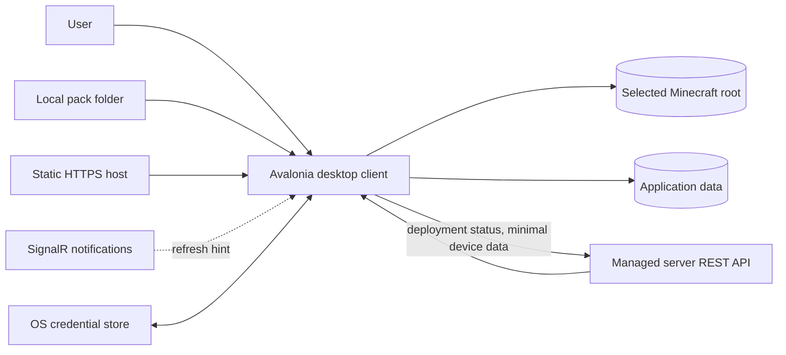

The selected Minecraft root is a security boundary, not merely a path setting. Application data—configuration, logs, journals, staging, and backups—normally lives outside it. The server receives instance identifiers and update status, never the absolute installation path or an inventory of unmanaged files.

### Startup and first-run flow

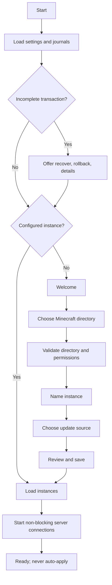

## 5. Technology stack

- C# and a supported modern .NET LTS release. Pin the SDK in `global.json` once implementation begins.
- Avalonia UI with MVVM and `CommunityToolkit.Mvvm` for observable properties and commands.
- `Microsoft.Extensions.DependencyInjection`, Configuration, and Logging using the generic host building blocks where helpful, without ASP.NET hosting assumptions.
- Typed `HttpClient` instances and the SignalR .NET client.
- `System.Text.Json`, `System.IO.Compression`, and `System.Security.Cryptography.SHA256`.
- Built-in asynchronous file APIs. Add third-party packages only for a demonstrated gap.
- JSON persistence in v1. SQLite is not warranted until history/hash-cache volume or transactional query needs become material.

ZIP support is for distribution or diagnostics, not for implicitly extracting arbitrary manifest content. If archive entries are ever accepted, every entry must pass the same safe-path and size-limit checks as normal files.

## 6. Client architecture overview

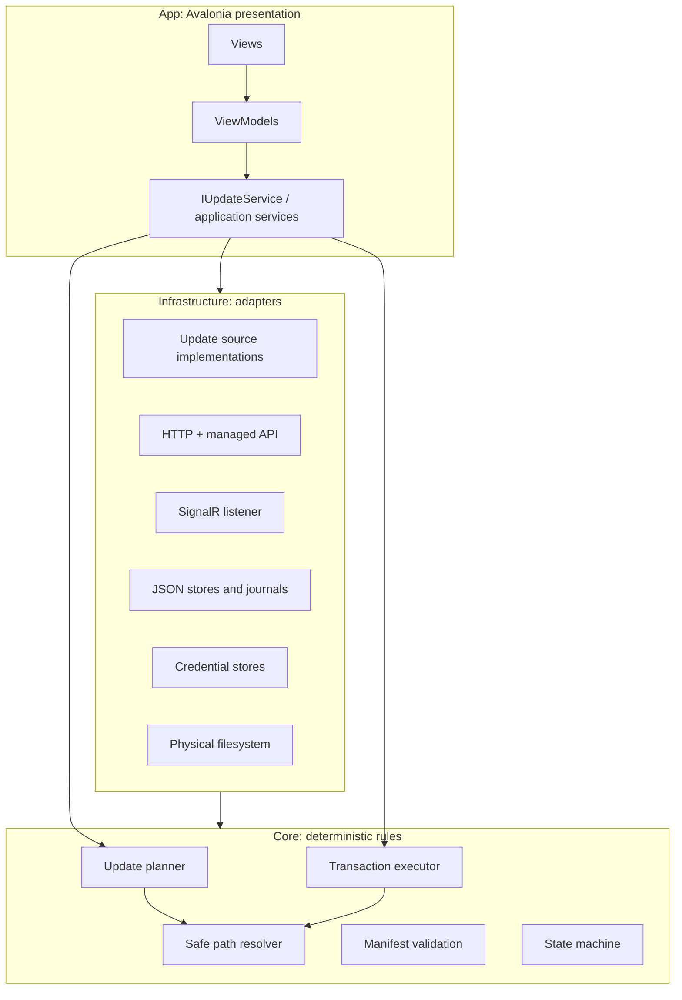

The application-service layer coordinates use cases: select source, load and validate manifest, create a plan, request confirmation through the ViewModel, execute, record history, and report status. Core contains business rules and abstractions. Infrastructure implements I/O. Presentation owns navigation and display state.

### Dependency rules

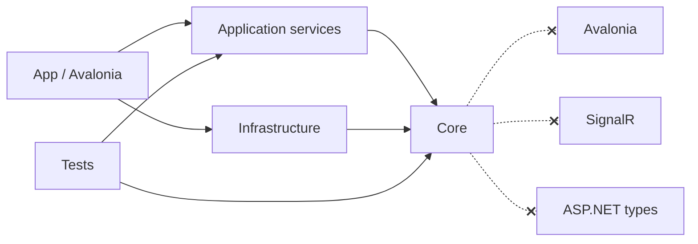

`Core` references only the .NET base libraries. Infrastructure may reference Core contracts. Composition happens in App. Avoid a separate Contracts project initially; place manifest wire models in Core only if their JSON contract is client-owned and stable. Split shared server contracts later if client and server are developed together and versioned carefully.

## 7. Project structure

```text
MinecraftManager.sln
src/
  MinecraftManager.App/
    App.axaml
    Views/ ViewModels/ Controls/ Converters/
    Navigation/ Composition/
  MinecraftManager.Core/
    Models/ Manifests/ Sources/ Planning/
    Filesystem/ Hashing/ Transactions/ Errors/
  MinecraftManager.Infrastructure/
    Http/ ManagedServer/ SignalR/ Persistence/
    Security/ Filesystem/ Diagnostics/
tests/
  MinecraftManager.Core.Tests/
  MinecraftManager.IntegrationTests/
  MinecraftManager.App.Tests/
```

Three production projects are enough. `App` contains thin orchestration services at first; introduce a separate Application project only if those use cases grow or another frontend is actually created.

## 8. Core domain model

```csharp
public sealed record MinecraftInstance
{
    public required Guid Id { get; init; }
    public required string DisplayName { get; init; }
    public required string RootPath { get; init; }
    public required UpdateSourceSettings Source { get; init; }
    public InstalledPackState? InstalledPack { get; init; }
    public DateTimeOffset CreatedAtUtc { get; init; }
    public DateTimeOffset? LastCheckedAtUtc { get; init; }
}

public abstract record UpdateSourceSettings
{
    public sealed record LocalFolder(string FolderPath) : UpdateSourceSettings;
    public sealed record StaticHttp(Uri BaseUri) : UpdateSourceSettings;
    public sealed record ManagedServer(Guid ServerProfileId, string? PackId) : UpdateSourceSettings;
}

public sealed record InstalledPackState(
    string PackId,
    string PackVersion,
    string ManifestSha256,
    DateTimeOffset InstalledAtUtc);

public sealed record ServerProfile(
    Guid Id,
    string DisplayName,
    Uri BaseUri,
    Guid? DeviceId,
    ServerConnectionStatus LastStatus);
```

`RootPath` is stored in user configuration but never sent to a server. Treat a moved or missing root as a recoverable configuration error. Validate display names for usability, not as filesystem identifiers. Source configuration is per instance so two installations can follow different packs or servers.

## 9. Update source abstraction

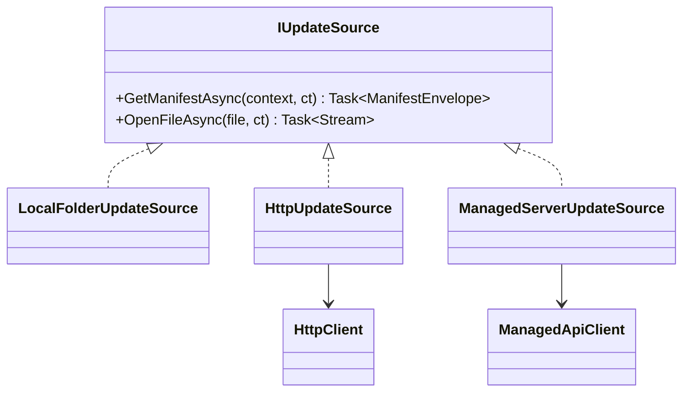

```csharp
public interface IUpdateSource : IAsyncDisposable
{
    string DisplayName { get; }
    Task<ManifestEnvelope> GetManifestAsync(
        ManifestRequest request, CancellationToken cancellationToken);
    Task<Stream> OpenFileAsync(
        ManifestFile file, CancellationToken cancellationToken);
}

public sealed record ManifestRequest(string? KnownETag, DateTimeOffset? IfModifiedSince);
public sealed record ManifestEnvelope(
    PackManifest? Manifest, string? ETag, DateTimeOffset? LastModified, bool NotModified);
```

The factory creates a short-lived source for an instance. An envelope accommodates HTTP caching without leaking HTTP response types into Core. The stream contract keeps download/copy behavior uniform; staging and hash validation remain in the shared downloader/executor. A network share can use local-folder semantics once deliberately selected. Modrinth data should be normalized upstream to the standard manifest to avoid coupling the client to another evolving API.

## 10. Manifest model and validation

```csharp
public sealed record PackManifest
{
    public required int SchemaVersion { get; init; }
    public required string PackId { get; init; }
    public required string PackVersion { get; init; }
    public string? MinimumClientVersion { get; init; }
    public required IReadOnlyList<string> ManagedPaths { get; init; }
    public required IReadOnlyList<ManifestFile> Files { get; init; }
    public ManifestMetadata? Metadata { get; init; }
}

public sealed record ManifestFile
{
    public required string Path { get; init; }
    public required string Sha256 { get; init; } // 64 lowercase hex characters
    public required long Size { get; init; }
    public string? ContentType { get; init; }
    public string? SourcePath { get; init; }
}

public sealed record ManifestMetadata(string? DisplayName, string? ReleaseNotes);
```

Parsing and semantic validation are separate. JSON parsing uses strict options, a maximum response size, bounded string/list counts, duplicate-path detection with platform-appropriate comparison, non-negative realistic sizes, valid hashes, supported URI forms, and rejection of unknown security-sensitive semantics. `SchemaVersion == 1` is supported initially. A higher version produces a clear `UnsupportedManifestVersion` result and no plan; an older version is handled only by an explicit adapter with tests. `MinimumClientVersion` is checked before scanning.

The manifest describes final regular-file content. Directories, symlinks, scripts, processes, permissions, registry operations, and environment changes are not valid operations. File URLs are resolved by the source and cannot override its trust boundary.

## 11. Filesystem security

### Safe path resolution

All manifest and managed-scope paths use `/` as the wire separator and are relative. Resolution must be centralized; callers never use `Path.Combine(root, manifestPath)` directly.

```csharp
public sealed class SafePathResolver
{
    public string ResolveFile(string trustedRoot, string manifestPath)
    {
        if (string.IsNullOrWhiteSpace(manifestPath) ||
            Path.IsPathRooted(manifestPath) ||
            manifestPath.Contains(':') || // reject drive prefixes and NTFS streams on every OS
            manifestPath.Contains('\0'))
            throw new UnsafePathException(manifestPath);

        var segments = manifestPath.Replace('\\', '/').Split('/');
        if (segments.Any(s => s is "" or "." or ".."))
            throw new UnsafePathException(manifestPath);

        var root = Path.TrimEndingDirectorySeparator(Path.GetFullPath(trustedRoot));
        var result = Path.GetFullPath(Path.Combine([root, .. segments]));
        var prefix = root + Path.DirectorySeparatorChar;
        var comparison = OperatingSystem.IsWindows()
            ? StringComparison.OrdinalIgnoreCase
            : StringComparison.Ordinal;

        if (!result.StartsWith(prefix, comparison))
            throw new UnsafePathException(manifestPath);
        return result;
    }
}
```

This lexical check is necessary but not sufficient. Before scanning, backing up, or applying, walk every existing ancestor from the trusted root using non-following filesystem metadata and reject symbolic links/reparse points. Re-check immediately before each mutation to reduce time-of-check/time-of-use exposure. Never write through an existing symlink; stage a regular file and replace the directory entry. For strongest guarantees, platform-specific handle-relative APIs may be added later, but v1 must fail closed when link safety cannot be established.

Reject drive-qualified paths, UNC paths, alternate data stream syntax on Windows, device names where relevant, trailing-dot/space aliases, and path collisions after Windows case folding. The chosen root itself is user-trusted, but resolve and persist its full path and warn if it is a symlink.

### Managed and unmanaged files

`managedPaths` are normalized relative directory prefixes or exact files. The manifest must not manage the root as a whole. A conservative allowlist initially permits `mods/`, selected `config/<pack-owned>/` paths, and explicitly named resource packs. Sensitive defaults (`saves/`, `screenshots/`, `logs/`, `crash-reports/`, `options.txt`, `servers.dat`) are rejected unless a future, separately consented policy supports them.

A deletion candidate must satisfy all of these:

- It is a regular file below the root with no symlink/reparse ancestor.
- It falls under a validated managed scope.
- It is absent from the desired manifest.
- It was previously recorded as managed by this pack, or the user explicitly opted into adopting/pruning that scope during plan review.
- It is displayed in the confirmed immutable plan.

Thus the default deletion set is `previouslyManagedFiles - desiredFiles`, not “all files not in the manifest.” Directories are removed only if the updater made/manages them and they are empty. Unmanaged content is never backed up, scanned beyond necessary boundary checks, or deleted.

## 12. Update planning and comparison

```csharp
public interface IUpdatePlanner
{
    Task<UpdatePlan> CreatePlanAsync(
        MinecraftInstance instance,
        PackManifest manifest,
        CancellationToken cancellationToken);
}

public sealed record UpdatePlan(
    Guid PlanId,
    Guid InstanceId,
    string PackId,
    string TargetVersion,
    string ManifestSha256,
    IReadOnlyList<PlannedFile> FilesToAdd,
    IReadOnlyList<PlannedReplacement> FilesToReplace,
    IReadOnlyList<PlannedDeletion> FilesToDelete,
    IReadOnlyList<string> UnchangedFiles,
    IReadOnlyList<PlanWarning> Warnings,
    long TotalDownloadSize,
    DateTimeOffset CreatedAtUtc);
```

Planning is read-only. It validates the instance, manifest, source compatibility, managed-scope evolution, client version, path safety, and local file types. For each desired file: missing means add; an equal SHA-256 means unchanged; otherwise replace. Deletions derive from the last successfully committed managed-file ledger. A plan is invalidated if the instance, manifest, or relevant local file metadata changes before execution; the executor revalidates hashes for replacement/deletion targets before modifying them.

Hash with sequential asynchronous reads and cancellation. Parallelism of two files may help SSDs but can hurt hard disks; begin sequentially and measure. A cache keyed by instance, relative path, length, last-write time, and file identity can be added later, but suspicious/coarse timestamps and all pre-apply checks require a fresh hash. Correctness wins over cache hits.

Plans include total download bytes, estimated backup bytes, required temporary space, unsafe-scope warnings, locked-file warnings where detectable, and source/target versions. Planning never creates staging, backups, or target directories.

## 13. Update transaction

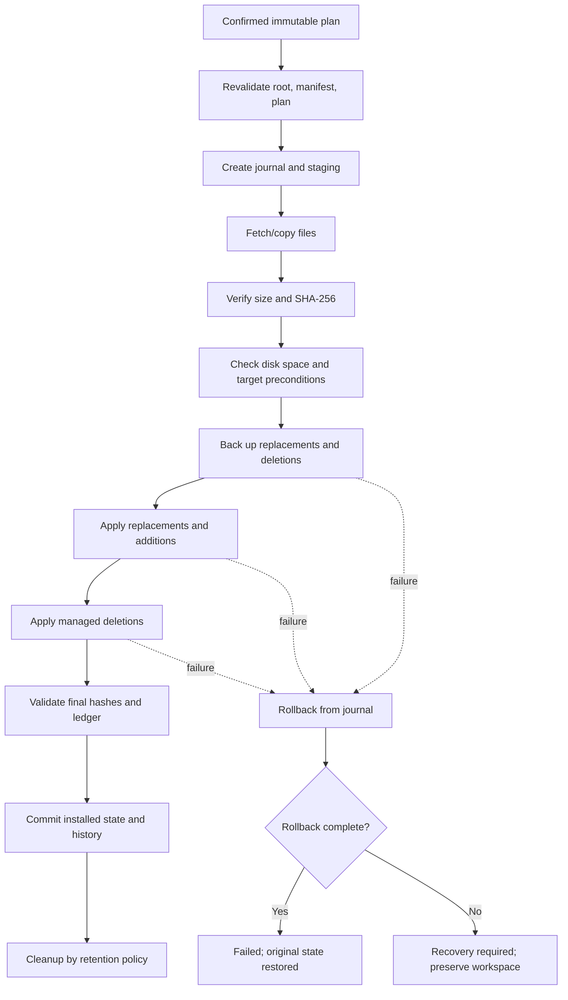

The workspace lives under the per-user application-data directory, not under `.minecraft`, to avoid polluting or accidentally managing game files. Layout:

```text
MinecraftManager/
  config.json
  state/instances/<instance-id>.json
  transactions/<transaction-id>/journal.json
  transactions/<transaction-id>/staging/...
  transactions/<transaction-id>/backup/...
  history/...
  logs/...
```

If the application-data volume differs from the Minecraft volume, final rename is not atomic across volumes. The executor therefore copies the verified staged file to a uniquely named temporary sibling under the target directory, flushes it, re-verifies when appropriate, and atomically renames/replaces it on that volume. Final filenames never contain partial downloads.

On Windows, `File.Replace` can replace an existing file on the same volume and optionally preserve a backup; sharing violations are common if Minecraft is running. On Linux, rename-over-target is atomic on one filesystem but open processes may retain the old inode. Platform capabilities are hidden behind `IAtomicFileOperations`, tested on both OS families. Durability across sudden power loss is best effort because portable .NET cannot promise a multi-file filesystem transaction.

### Backup and rollback

Before the first target mutation, copy or same-volume-move every replacement/deletion target into transaction backup, preserving its relative path and recording hash, size, timestamps, and action in the journal. Do not back up additions or unmanaged directories. Journal writes use write-temp, flush, atomic replace and happen before/after each irreversible step.

Rollback runs in reverse operation order: remove applied additions, restore replacements, then restore deletions. Every action is idempotent and checks expected hashes. If rollback partially fails, stop automatic cleanup, mark `RecoveryRequired`, preserve staging/backups/journal, identify affected paths, and offer retry plus manual instructions. Never claim the instance is healthy.

Retain the last three successful transaction backups or 14 days by default, bounded by a user-visible storage limit. Failed/recovery-required transactions are never automatically removed. Abandoned pre-apply staging older than seven days can be deleted at startup after verifying its path is within the application transaction directory.

### Disk space and locks

Estimate staging bytes for additions/replacements, backup bytes for existing replacement/deletion targets, target-volume sibling-temp bytes, journal overhead, and a safety margin (for example 10% with a reasonable minimum). Query every involved volume separately. Recheck before apply.

Recommend closing Minecraft before apply. A best-effort exclusive open can identify some locks, but lack of a detected lock is not proof. On sharing violations, pause safely before mutation or roll back, explain which file is in use, and offer Retry. Never terminate a process without a separate explicit user action; v1 need not offer termination.

## 14. State machine, cancellation, and progress

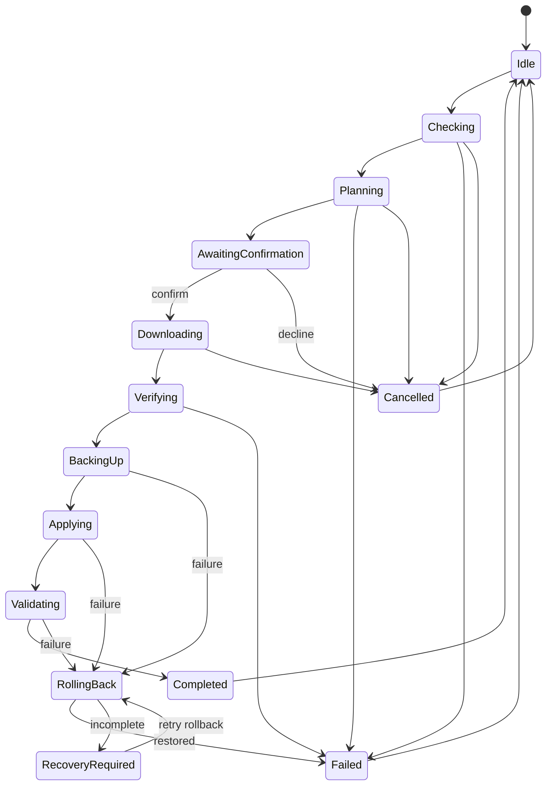

One state object, owned by `IUpdateService`, controls commands and UI. Do not combine booleans such as `IsBusy`, `IsDownloading`, and `HasError`. Cancellation is honored while checking, hashing, and downloading. Once backup begins, a user cancellation request becomes “cancel after reaching a safe point”; it cannot interrupt an atomic operation or rollback. The UI disables the immediate Cancel action and explains why.

```csharp
public sealed record UpdateProgress(
    UpdateStage Stage,
    string? CurrentRelativePath,
    int CompletedFiles,
    int TotalFiles,
    long ProcessedBytes,
    long TotalBytes,
    double? Percentage,
    string Message);

public interface IUpdateExecutor
{
    Task<UpdateResult> ExecuteAsync(
        ConfirmedUpdatePlan plan,
        IUpdateSource source,
        IProgress<UpdateProgress> progress,
        CancellationToken cancellationToken);
}
```

`ConfirmedUpdatePlan` is produced only after the application records explicit confirmation and contains a plan integrity token. Progress is throttled (for example to 10 UI updates/second) and marshalled onto Avalonia's UI scheduler by the ViewModel.

## 15. Download architecture

`IDownloadManager` pulls each add/replacement stream into its exact transaction staging path, enforcing declared and global byte limits while streaming SHA-256. It rejects early EOF, excess data, mismatched size, and mismatched hash. The executor performs a final independent verification before apply.

HTTP downloads use a small bounded concurrency (default 4), per-request timeout plus an overall operation cancellation token, and retries for transient network failures, 408, 429, and selected 5xx responses. Use jittered exponential delays such as 1, 2, and 4 seconds and honor `Retry-After`. Do not retry authentication, manifest validation, 404, or hash mismatch blindly. Dispose responses and streams promptly.

Range resume is deferred; it requires validators (`ETag`/`Last-Modified`), persisted partial metadata, and careful hash continuation. Local sources use the same manager with concurrency 1 or 2 to avoid disk contention. Local copying does not bypass size or hash validation.

## 16. Source modes

### Local folder

The selected source root must contain `manifest.json` and a `files/` directory. `SourcePath`, or otherwise the manifest `Path`, resolves below `files/` using a second `SafePathResolver` boundary. Symlinks/reparse points are rejected. The source and Minecraft root may not overlap in a way that lets applying an update mutate the source.

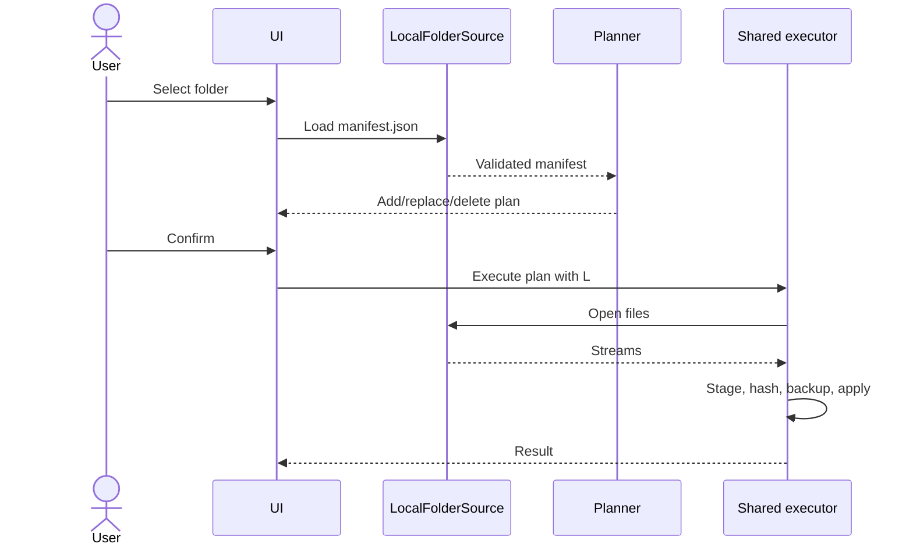

### Static HTTP

For base `https://example.com/minecraft-pack/`, the manifest is `manifest.json` and files default to `files/<encoded path segments>`. Construct URLs by escaping each path segment; never accept a manifest path as a complete URL. If explicit file URLs are supported later, require same-origin HTTPS unless the user approves a declared host allowlist.

Use conditional GET with ETag and Last-Modified, but parse/validate the cached manifest again and key it by normalized source URI. Permit redirects only to HTTP(S), cap the redirect count, reject HTTPS-to-HTTP downgrade by default, and prevent redirection to `file:` or other schemes. HTTPS is required for public sources; plain HTTP may be allowed for explicitly configured LAN addresses with a persistent warning because hashes provide integrity against corruption, not authenticity against an attacker who can replace both file and manifest.

### Managed server

REST over HTTPS is authoritative for registration, assignment, manifest retrieval, file authorization, and deployment status. SignalR carries only small allowlisted events such as `UpdateAvailable`, `PackAssignmentChanged`, `DeploymentCancelled`, and `RefreshRequested`; all lead to a debounced REST refresh and never directly change files.

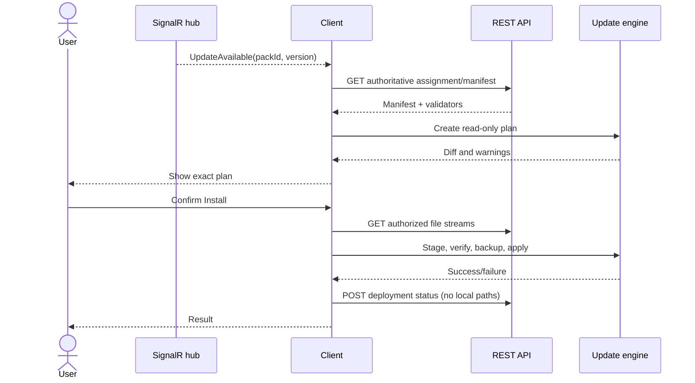

Server profiles accept LAN IPs, DNS names, public hosts, and private VPN addresses. Normalize and validate the base URI, forbid embedded credentials, and display whether transport is secure. Never globally disable certificate validation. Private PKI should install its CA into the OS trust store. Certificate pinning is optional advanced hardening with rotation/recovery design; a one-off invalid-certificate bypass is not offered.

## 17. SignalR integration

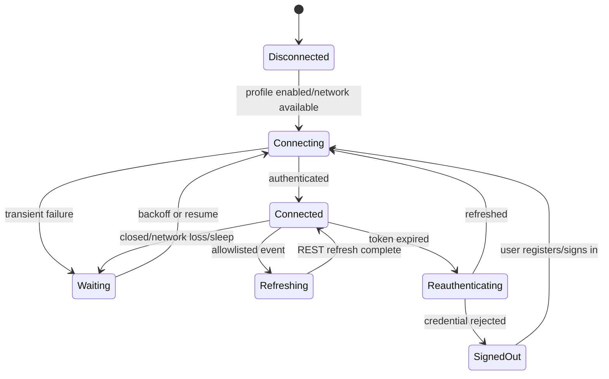

`IServerConnectionService` maintains one connection per enabled profile only when useful. Automatic reconnect uses bounded jittered delays (0, 2, 10, 30 seconds, then periodic attempts), responds to sleep/resume and network changes, and re-acquires access tokens before reconnect. Event handlers validate type and payload size, enqueue a coalesced refresh, and return quickly. REST failures leave cached UI data visible with an Offline/Stale label.

## 18. Authentication and credential storage

Managed mode registers a device to obtain a random `deviceId`, short-lived access token, and refresh credential or equivalent. The device ID is not secret. Windows stores secrets through Credential Manager or DPAPI bound to the current user; Linux uses Secret Service/libsecret through an isolated adapter.

If no secure store is available, managed mode should be disabled by default with an explanation and remediation. An explicit fallback may store an encrypted credential using a user-supplied passphrase and a modern KDF; never put plaintext tokens in `config.json`, logs, command lines, crash reports, or UI. Keep tokens in memory only as long as needed and redact authorization/query-token data centrally in HTTP logging.

Removal of a server profile deletes its local credential and attempts server-side device revocation when online. Failed revocation is disclosed to the user.

## 19. Local persistence

Use versioned JSON written atomically:

- `config.json`: instances, server-profile metadata, source selections, preferences.
- `state/instances/<id>.json`: installed pack, last successful manifest hash, managed-file ledger, last check.
- `history/<instance-id>.jsonl` or bounded JSON: lightweight update outcomes.
- `transactions/<id>/journal.json`: durable recovery metadata.
- optional `cache/manifests/`: validated responses plus source identity/ETag.

Serialize to a sibling temporary file, flush, then replace. Keep a last-known-good backup for main configuration. Use a process-wide writer lock and do not support two concurrently running clients against the same data directory. Migrations are explicit by schema version; never silently discard unreadable state.

Representative configuration (credentials deliberately absent):

```json
{
  "schemaVersion": 1,
  "instances": [
    {
      "id": "447a36c4-5ed7-484e-974b-a0b94c81a6ec",
      "displayName": "Fabric 1.21",
      "rootPath": "D:\\Games\\Minecraft-Fabric",
      "source": {
        "type": "managedServer",
        "serverProfileId": "cf123673-5a4d-40c2-b25d-2f897732758e",
        "packId": "main-pack"
      }
    }
  ],
  "serverProfiles": [
    {
      "id": "cf123673-5a4d-40c2-b25d-2f897732758e",
      "displayName": "Home Server",
      "baseUri": "https://minecraft-server.lan"
    }
  ],
  "settings": {
    "theme": "system",
    "maxConcurrentDownloads": 4,
    "backupRetentionCount": 3
  }
}
```

SQLite becomes worthwhile only if the managed ledger/hash cache reaches a scale where atomic JSON rewrites or lookup time are measured problems. Credentials remain outside either store.

## 20. Crash recovery

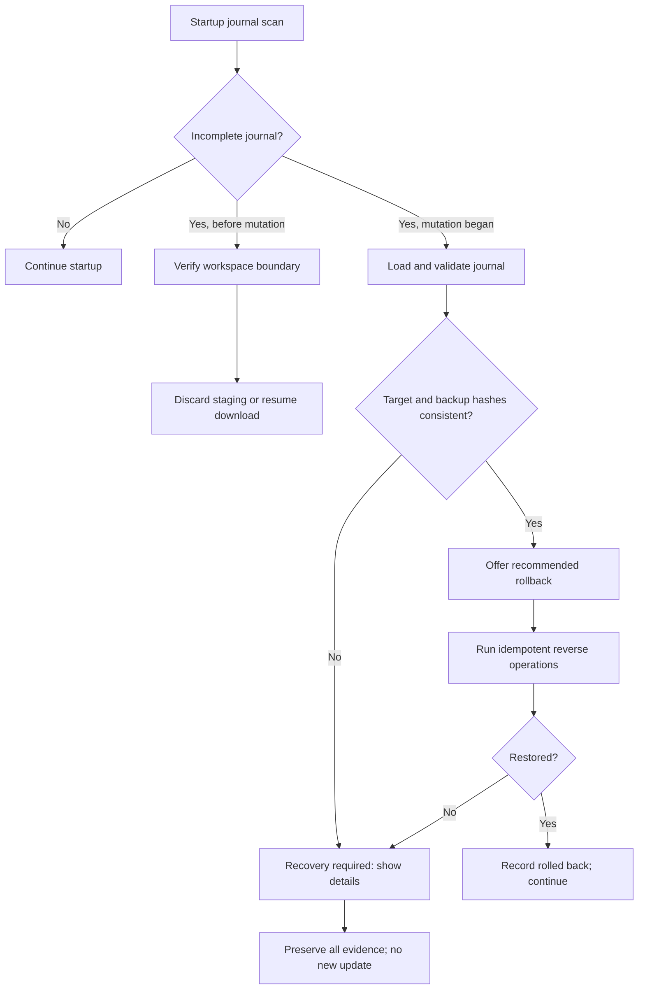

The journal records transaction and instance IDs, canonical root identity, manifest/plan hashes, phase, every backup, intended mutation, completed mutation, and expected before/after hashes. Startup blocks new updates for that instance until recovery is resolved. Automatic rollback is recommended after mutation has begun; “continue apply” is offered only when all staged files, backups, manifest, plan, and current target preconditions validate. A details view lists affected relative paths without exposing secrets.

## 21. Cross-platform considerations

| Concern | Windows | Linux | Policy |
|---|---|---|---|
| Case | Usually insensitive | Usually sensitive | Detect collisions for target platform; use ordinal rules appropriate to volume |
| Locks | Sharing modes often block replace | Open inode usually permits rename | Require Minecraft closed; map errors clearly |
| Links | Symlinks, junctions, reparse points | Symlinks and mount boundaries | Reject link traversal and recheck before mutation |
| Names | Reserved devices, ADS, trailing aliases | More names valid | Validate to stricter safe target rules where needed |
| Permissions | ACLs/read-only attribute | mode/ownership | Preflight write access; preserve only intended metadata |
| Executable bit | Not relevant | Relevant | Pack files are data; never add execute permission |
| Rename | Same-volume atomic primitives differ | Same-filesystem rename | Adapter plus sibling temporary file |
| App data | `LocalApplicationData` | XDG data/state conventions | Use platform service; honor XDG variables |
| Paths | `\`, drive/UNC | `/`, case-sensitive | Manifest always `/`; built-in path APIs locally |

Use `Environment.GetFolderPath`, `Path.Combine`, `Path.GetFullPath`, and a platform-directory service. Do not hardcode home directories or default `.minecraft` as the only choice. High-DPI/layout tests must cover Windows scaling and common Linux desktop scale factors.

## 22. Avalonia UI architecture

```text
View -> ViewModel -> application service -> core/infrastructure
```

Views bind state and route user gestures. ViewModels own presentation state, validation messages, navigation requests, and commands. Application services own use-case coordination. Core/infrastructure perform network and filesystem I/O. A ViewModel never receives `FileStream`, `HttpClient`, or a target path writer.

Important ViewModels:

- `MainWindowViewModel`: shell navigation, selected instance, global connection/recovery banners.
- `InstanceListViewModel`: instance selection/add/remove.
- `InstanceDetailsViewModel`: installed/available pack summary and check command.
- `FirstRunViewModel`: guided instance and source setup.
- `InstanceEditorViewModel`: directory validation and per-instance source configuration.
- `UpdateReviewViewModel`: immutable diff grouping, warnings, size, confirmation.
- `UpdateProgressViewModel`: typed stage/progress and safe cancellation.
- `ServerListViewModel` / `ServerDetailsViewModel`: profile metadata and registration state.
- `HistoryViewModel`: bounded outcome list and details.
- `SettingsViewModel`: validated user preferences.
- `RecoveryViewModel`: journal inspection and recover/rollback operations.

Reusable controls are justified for `InstanceCard`, `ConnectionStatusIndicator`, `UpdateSummary`, `FileChangeList`, `ProgressSummary`, `ErrorBanner`, `ServerCard`, and `SourceSelector`. Standard buttons, lists, inputs, and dialogs remain standard controls.

Services are generally singletons in a desktop process when they own coherent state (`IInstanceService`, settings, history, connection manager, credential store, transaction coordinator). Stateless planner, path resolver, hash service, and validators can also be singletons. Source instances and update sessions are transient and disposed. A custom per-operation scope is useful only to group an update's source, journal, cancellation, and metrics; do not emulate web request scopes.

```csharp
services.AddSingleton<ISettingsService, JsonSettingsService>();
services.AddSingleton<IInstanceService, InstanceService>();
services.AddSingleton<IManifestValidator, ManifestValidator>();
services.AddSingleton<ISafePathResolver, SafePathResolver>();
services.AddSingleton<IUpdatePlanner, UpdatePlanner>();
services.AddSingleton<IUpdateExecutor, UpdateExecutor>();
services.AddSingleton<IUpdateService, UpdateService>();
services.AddSingleton<IUpdateSourceFactory, UpdateSourceFactory>();
services.AddSingleton<IHistoryService, JsonHistoryService>();
services.AddSingleton<ISecureCredentialStore, PlatformCredentialStore>();
services.AddSingleton<IServerConnectionService, ServerConnectionService>();
services.AddHttpClient<HttpUpdateSource>();
services.AddHttpClient<IManagedApiClient, ManagedApiClient>();
services.AddTransient<MainWindowViewModel>();
```

## 23. Navigation, layout, and wireframes

Use a desktop shell with an instance rail and a single content area. Minimum window size: approximately 900×600 logical pixels; support resizing, scrolling, keyboard navigation, and 200% scaling. On narrow windows, collapse the rail into a selector. Theme choices are System, Light, and Dark using Avalonia theme resources—not business-logic colors. Status always uses text/icon plus color.

### First run

```text
┌ Minecraft Manager ─────────────────────────────────────┐
│ Welcome                                                │
│ Keep your Minecraft pack synchronized safely.          │
│                                                       │
│ Minecraft folder  [ Choose folder… ]                   │
│ No files are changed during setup.                     │
│                                      [Continue]         │
└────────────────────────────────────────────────────────┘
```

### Main screen

```text
┌ Minecraft Manager ─────────────────────── ● Online ─────┐
│ Instances       │ Fabric 1.21                           │
│ > Fabric 1.21   │ Pack: Main Pack                      │
│   Vanilla       │ Installed 1.4.0 · Available 1.5.0    │
│   Testing       │ Source: Home Server                  │
│                 │ [Check again] [Review update]         │
│ [+ Add]         │ Last result: successful              │
│ Servers         │                                      │
│ History         │                                      │
│ Settings        │                                      │
└─────────────────┴──────────────────────────────────────┘
```

### Instance configuration

```text
Edit instance
Name              [Fabric 1.21                  ]
Minecraft folder  [D:\Games\Minecraft-Fabric] [Browse]
                   ✓ Directory found and writable
Update source     [Home Server / Main Pack       ] [Change]
                   [Cancel] [Save]
```

Changing the root or source requires an explicit review and invalidates cached plans; it never silently migrates files.

### Update source selection

```text
Choose update source
(•) Managed server   [Home Server ▼] [Main Pack ▼]
( ) Remote HTTP      [https://example.com/pack/]
( ) Local folder     [D:\MinecraftPack] [Browse]
                     [Test source]
                     [Cancel] [Use this source]
```

### Server management

```text
Servers                         Home Server
● Home Server                   Address: https://minecraft-server.lan
○ Remote Server                 Device: DESKTOP-ABC
[Add server]                    Status: Connected
                                [Reconnect] [Remove]
```

Tokens are never displayed. Plain HTTP profiles show a persistent transport warning.

### Update review

```text
Update Main Pack: 1.4.0 → 1.5.0
Download 124 MB · Backup up to 38 MB
[Summary] [Files]
+ Add (4)       mods/new.jar
~ Replace (3)   config/example.json
- Delete (1)    mods/old.jar
! Minecraft must be closed before installation.
[Cancel]                                  [Install update]
```

The file list supports grouping, search, copy-relative-path, and accessible symbols/text. Deletions are expanded or otherwise unmistakable before confirmation.

### Update progress

```text
Installing 1.5.0
Downloading 7 of 12 files
[██████████████████░░░░░░] 72% · 89 / 124 MB
mods/example.jar
[Cancel download]
```

During apply: `Applying verified files—do not close the app` and no unsafe cancel button. Closing the window triggers the lifecycle policy.

### Update failure

```text
Update could not be completed
Unable to replace mods/example.jar. The file appears in use.
Close Minecraft and try again.
Your previous files were restored successfully.
[View technical details] [Open logs] [Retry]
```

If rollback is incomplete, replace the reassurance with a prominent Recovery required message and disable further updates.

### Update history

```text
Update history — Fabric 1.21
1.5.0  Installed successfully       Today 15:42
1.4.0  Installed successfully       Aug 14
1.3.2  Failed · rolled back         Aug 10
[Selected: 7 changed · Home Server · 48 s · Details]
```

### Settings

```text
Settings
General    Theme [System ▼]  Check on startup [✓]
Downloads  Concurrent downloads [4]  Timeout [60 s]
Backups    Keep last [3]  Maximum age [14 days]
Network    Proxy [System]  Allow HTTP on explicitly chosen LAN [ ]
Advanced   [Open app data] [View logs] [Clear hash cache]
```

### Interrupted update

```text
Interrupted update detected — Fabric 1.21
Changes had begun. Rollback is recommended before continuing.
Backup: verified · 3 files affected
[View details] [Retry recovery] [Roll back]
```

## 24. UX and accessibility rules

- Never modify pack files without an exact plan and explicit confirmation.
- Never hide or euphemize deletion; show relative paths and counts.
- Always identify the selected instance, source, pack, installed version, and target version.
- Never silently switch source/root, trust invalid TLS, or react destructively to a notification.
- Keep stale cached information visible but label it Offline/Stale.
- Present a plain-language error first and technical details on demand.
- Provide logical tab order, visible focus, keyboard operation, accessible names, scalable text, sufficient contrast, and icon/text status independent of color.
- Confirmation buttons name the action (`Install update`), while dangerous recovery actions explain consequences.

## 25. Errors, logging, and diagnostics

Core maps low-level exceptions into stable categories: `NetworkError`, `AuthenticationError`, `ManifestError`, `UnsupportedManifestVersion`, `HashMismatch`, `UnsafePathError`, `FilesystemPermissionError`, `FileInUseError`, `InsufficientDiskSpace`, `SourceUnavailable`, `RollbackError`, and `RecoveryRequired`. Each carries a correlation/transaction ID, safe context (relative path), retryability, and an inner exception for logs. ViewModels map categories to localized user text.

Example: primary text says “Unable to replace `mods/example.jar`; it appears to be in use. Close Minecraft and retry.” Technical details may show exception type, OS error, stage, timestamp, and transaction ID—not secrets or file contents.

Use structured `Microsoft.Extensions.Logging` with scopes for transaction ID, instance ID, pack/version, source type, stage, counts, and durations. Never log tokens, cookies, signed URLs/query secrets, absolute Minecraft paths by default, usernames, home directories, file contents, or unmanaged filenames. Sanitize HTTP logging and keep rolling logs bounded.

A later “Export diagnostics” action can create a ZIP containing logs, client/OS/runtime versions, sanitized configuration, and recent journal/history summaries. Preview its contents and exclude credentials. Diagnostic archives are never uploaded without a separate user action.

## 26. Security and privacy model

| Threat | Main controls |
|---|---|
| Malicious/malformed manifest | Strict schema/semantic/size limits; no executable operations; explicit review |
| Path traversal/absolute paths | Central resolver, canonical containment, collision checks |
| Symlink/reparse attacks | Non-following ancestor checks, fail closed, recheck at mutation |
| Arbitrary deletion | Managed scope plus prior managed ledger plus confirmed plan |
| Corrupted/substituted file | Declared size and SHA-256 before and after staging |
| Compromised server | Least-power manifest vocabulary, confirmation, boundaries, optional signatures |
| MITM | HTTPS and OS trust; no global bypass; warnings/restrictions for LAN HTTP |
| Stolen credential | OS secure store, short-lived access, refresh/revoke, redaction |
| Rollback/downgrade attack | Show versions, server policy/minimum version, require confirmation; optional signed monotonic metadata |
| Resource exhaustion | Manifest/file/count/path/size limits, disk preflight, bounded concurrency/cache |
| SignalR abuse | Allowlisted bounded notifications followed by REST refresh |

Security invariants:

- Every source and target path remains inside its explicit root.
- Only recorded files in validated managed scopes may be deleted automatically.
- Every copied/downloaded file is SHA-256 validated.
- No update instruction can execute a process, script, or downloaded content.
- No Minecraft modification occurs before user confirmation.
- Credentials are isolated and protected; logs and diagnostics are redacted.
- A failed or ambiguous safety check stops the operation.

HTTPS plus authenticated managed REST and SHA-256 is adequate for v1 when the manifest and content share the trusted server boundary. SHA-256 alone does not authenticate a static manifest. Signed manifests are a valuable later hardening feature for CDN/static distribution and compromised-origin resistance, but require key provisioning, rotation, revocation, canonical serialization, and rollback policy. Reserve `signature`/`keyId` extension points; do not implement an improvised signature scheme.

The server may receive device ID, client version, OS family, architecture, instance ID (random), assigned pack/version, and deployment status. It does not receive absolute paths, OS username/home, save names, screenshots, unmanaged filenames, or file contents. Even managed relative paths need not be reported individually unless diagnosing an explicitly approved error report.

## 27. Testing strategy

### Unit tests

- Safe-path cases: traversal, rooted/UNC/drive paths, separators, ADS/device names, case collisions, prefix traps, symlink policy.
- Manifest parse and semantic bounds, schema adapters, duplicates, client compatibility.
- Plan add/replace/unchanged/delete behavior and immutable plan invalidation.
- Managed ledger/scope changes and protected unmanaged files.
- SHA-256 streaming and mismatch/length behavior.
- State-machine valid/invalid transitions and cancellation gates.
- Static URL segment encoding, same-origin rules, redirect policy.
- Error mapping and credential/log redaction.

### Filesystem integration tests

Use a new temporary directory per test and an injected filesystem abstraction only where it helps simulate failure. Test add, replace, managed delete, unmanaged preservation, empty-directory cleanup, same-volume atomic replacement, locked/read-only files, insufficient space seams, hash failure before mutation, apply failure with full rollback, rollback failure, and every crash journal checkpoint. Include symlink/junction tests when CI privileges permit.

### Network integration tests

Use an in-process test HTTP server for conditional GET, redirects, timeouts, throttling, truncation, overlong bodies, authentication refresh, retries, and content substitution. Use an ASP.NET Core test server/container for managed API and SignalR reconnect, restart, invalid events, expired tokens, and notification coalescing.

### UI tests

Automate a small set of high-value workflows: first run, invalid folder, source selection, update review/confirmation, cancellation during download, failure details, and crash-recovery prompt. Keep visual/theme checks focused; most behavior belongs in ViewModel tests. Manually verify keyboard/screen-reader basics, scaling, long paths, both themes, and small windows.

CI builds and tests on Windows and Linux. Run target-runtime publish smoke tests for all four RIDs; arm64 may use build plus periodic real-device/VM testing if hosted CI is unavailable.

## 28. Performance and lifecycle

All hashing, downloads, copies, backups, parsing, and journal I/O run off the Avalonia UI thread with `async` APIs where genuine asynchronous I/O exists. Do not wrap every operation in `Task.Run`; use it selectively for CPU hashing if profiling shows UI contention. Bound download concurrency and avoid concurrent hashing on slow disks. Batch/throttle progress and virtualize long file lists.

Startup loads configuration, validates journals, loads instances/history, then starts network connections and optional update checks. Checks may produce a plan/notification but never auto-apply. Offline mode retains instance management, prior state/history, and local-folder updating.

On shutdown, downloads can be cancelled and resumable state discarded/preserved safely. During backup/apply/rollback, show a warning and delay graceful shutdown until a safe checkpoint; if the OS terminates the process, the journal supports recovery. Persist journal updates before acknowledging shutdown. Optional tray/background behavior is deferred and still may only notify, never apply.

## 29. Packaging and compatibility

Publish deterministic self-contained, single-RID builds for `win-x64`, `win-arm64`, `linux-x64`, and `linux-arm64`. Start with signed Windows portable ZIP plus a simple installer, and Linux `tar.gz`; add MSIX/AppImage/deb/rpm when update/uninstall integration demand justifies their maintenance. Document supported distro/glibc and desktop/keyring dependencies. Code-sign releases where feasible and publish checksums.

Pack updates and client application updates have different models, storage, trust, and processes. Exclude self-update from v1; later use a dedicated signed release updater that cannot write inside configured Minecraft roots.

Manifests include `schemaVersion` and optional `minimumClientVersion`. Compare semantic versions with a tested parser. Unsupported requirements stop before planning and say, for example, “This pack requires Minecraft Manager 1.6 or newer.” Unknown required features are never ignored.

## 30. End-to-end scenarios

### Managed update

1. The client loads the selected instance and connects to its server profile.
2. SignalR reports version 1.5.0; the client retrieves authoritative assignment and manifest through REST.
3. Manifest/security validation succeeds; the planner scans only desired/prior-managed paths.
4. The UI shows 4 additions, 3 replacements, 1 deletion, sizes, target version, and warnings.
5. The user closes Minecraft and confirms.
6. The client verifies free space, stages all content, and validates SHA-256.
7. It writes the recovery journal, backs up affected files, applies changes, and validates final state.
8. It commits version 1.5.0 and the new managed ledger, records history, reports sanitized success, and applies retention cleanup.

### Local folder update

The user selects `D:\MinecraftPack`. The client loads and validates `manifest.json`, resolves all sources below `files/`, creates the same `UpdatePlan`, and shows the same review. After confirmation, streams are copied to staging and hash-checked. From backup onward, the exact same executor and recovery process is used as in managed mode.

## 31. Key contracts

```csharp
public interface IManifestValidator
{
    ValidatedManifest Validate(PackManifest manifest, ClientCapabilities capabilities);
}

public interface ISafePathResolver
{
    ResolvedPath ResolveFile(TrustedRoot root, RelativeManifestPath path);
    void VerifyNoLinks(TrustedRoot root, ResolvedPath path);
}

public interface IHashService
{
    Task<string> ComputeSha256Async(Stream stream, CancellationToken cancellationToken);
    Task<bool> MatchesFileAsync(string path, string expectedSha256, CancellationToken cancellationToken);
}

public interface ITransactionJournalStore
{
    Task WriteAsync(TransactionJournal journal, CancellationToken cancellationToken);
    Task<IReadOnlyList<TransactionJournal>> FindIncompleteAsync(CancellationToken cancellationToken);
}

public interface IUpdateService
{
    UpdateSessionState CurrentState { get; }
    Task<UpdatePlan> CheckAsync(Guid instanceId, CancellationToken cancellationToken);
    Task<UpdateResult> InstallAsync(Guid planId, UserConfirmation confirmation,
        IProgress<UpdateProgress> progress, CancellationToken cancellationToken);
}

public abstract record UpdateFailure(string Code, string SafeMessage, bool IsRetryable)
{
    public sealed record UnsafePath(string RelativePath)
        : UpdateFailure("unsafe_path", "The pack contains an unsafe path.", false);
    public sealed record HashMismatch(string RelativePath)
        : UpdateFailure("hash_mismatch", "A downloaded file failed verification.", true);
    public sealed record FileInUse(string RelativePath)
        : UpdateFailure("file_in_use", "A file is in use. Close Minecraft and retry.", true);
}
```

Prefer small concrete classes where only one implementation is expected. Interfaces above represent security/test boundaries or multiple adapters, not a rule that every class needs an interface.

## 32. Architectural decisions

Each ADR is summarized here; promote it to a separate file if the decision changes or needs extended discussion.

### ADR-001 — Avalonia UI

**Context:** One desktop UI must run on Windows and Linux. **Decision:** Use Avalonia. **Alternatives:** WPF is Windows-only; MAUI desktop Linux support is unsuitable; web UI adds hosting complexity. **Consequences:** One XAML/MVVM UI and theming model, with Avalonia-specific testing and packaging work.

### ADR-002 — MVVM presentation

**Context:** UI state must be testable and separated from I/O. **Decision:** MVVM with CommunityToolkit helpers. **Alternatives:** Code-behind is initially simpler; reactive frameworks add dependencies. **Consequences:** Thin views and testable ViewModels, while avoiding logic-free interface ceremony.

### ADR-003 — Shared update engine

**Context:** Local, HTTP, and managed modes need identical safety. **Decision:** All implement `IUpdateSource` and use one planner/executor. **Alternatives:** Per-source workflows duplicate rules. **Consequences:** Consistent behavior and easy source extension; source contract must stay capability-neutral.

### ADR-004 — REST is authoritative

**Context:** Managed state must tolerate missed/reordered messages. **Decision:** Retrieve assignment/manifests and report status through REST. **Alternatives:** Stateful hub protocol. **Consequences:** Idempotent, debuggable refreshes and conventional HTTP caching.

### ADR-005 — SignalR notifications only

**Context:** Users benefit from prompt updates but hubs are transient. **Decision:** Allowlisted small events trigger REST refresh. **Alternatives:** Send manifests/binaries or commands over the hub. **Consequences:** Reconnect is simple and notifications have no filesystem authority.

### ADR-006 — Explicit confirmation

**Context:** Updates replace/delete local files. **Decision:** Show a read-only plan and require confirmation before staging/application session proceeds. **Alternatives:** unattended auto-update. **Consequences:** Safer, transparent UX; background mode can notify but not install.

### ADR-007 — SHA-256 content identity

**Context:** Size/timestamps do not prove equality. **Decision:** SHA-256 defines desired content. **Alternatives:** timestamp/size, weaker hashes, platform signatures. **Consequences:** Portable strong integrity at a manageable hashing cost; authenticity still depends on manifest trust.

### ADR-008 — Staged transactions

**Context:** Direct downloads can leave partial installations. **Decision:** Stage, verify, journal, back up, then replace atomically per file. **Alternatives:** in-place writes or full directory swaps. **Consequences:** More disk usage and complexity, but predictable rollback and no partial final files.

### ADR-009 — Managed-path deletion boundary

**Context:** Minecraft roots contain valuable user data. **Decision:** Delete only prior-ledger files within validated managed scopes and confirmed plans. **Alternatives:** mirror/purge the whole root. **Consequences:** Strong preservation; pack authors must declare ownership and scope changes carefully.

### ADR-010 — No arbitrary remote execution

**Context:** A remote updater could become an administration backdoor. **Decision:** Protocol vocabulary contains declarative pack state and harmless refresh hints only. **Alternatives:** generic commands/scripts. **Consequences:** Reduced attack surface; unusual installation tasks remain outside the client.

### ADR-011 — Multiple instances in the model

**Context:** Users often keep vanilla, modded, and test installations. **Decision:** All state is keyed by instance ID, even if early UI emphasizes one. **Alternatives:** global singleton path. **Consequences:** Small initial modeling cost avoids a disruptive migration.

### ADR-012 — Local folder uses normal pipeline

**Context:** Local media can also be corrupt or malicious. **Decision:** Copy through staging and apply all hash/path/confirmation rules. **Alternatives:** direct trusted copy. **Consequences:** Same guarantees and tests, with modest extra I/O.

### ADR-013 — JSON persistence first

**Context:** One-user configuration and bounded history are small. **Decision:** Atomic versioned JSON plus transaction journals. **Alternatives:** SQLite everywhere. **Consequences:** Easy inspection/debugging and fewer dependencies; migrate if measured scale requires it.

### ADR-014 — Application data outside Minecraft

**Context:** Internal workspaces must not collide with managed game data. **Decision:** Put staging, backups, state, and logs in per-user app data. **Alternatives:** `.minecraft-manager` under every instance. **Consequences:** Cleaner roots and centralized recovery; cross-volume final replace needs a target sibling temp.

## 33. Implementation roadmap

### Phase 1 — Core updater with local folders

Create the solution, manifest/parser limits, trusted path types, symlink policy, hashing, managed ledger, scanner, immutable planner, local source, staging, and basic apply. Build adversarial unit/integration tests first for paths and deletion.

### Phase 2 — Basic Avalonia workflow

Add instance configuration/folder picker, source selection, main shell, review, typed progress, cancellation, and friendly errors. Keep one visible instance viable while persisting a list.

### Phase 3 — Transaction safety

Add durable journals, backups, rollback, startup recovery UI, disk-space estimation, file-lock handling, atomic platform adapter, retention, and shutdown gates. This phase is required before calling updates production-safe.

### Phase 4 — Static HTTP

Add typed clients, URL policy, conditional caching, limits, retry/backoff, parallel downloads, progress, redirects, and public-HTTPS/LAN-HTTP UX. Test hostile/truncated responses.

### Phase 5 — Managed server

Add server profiles, secure registration/credential adapters, authenticated REST, assignment/manifest/file endpoints, sanitized deployment reporting, offline state, and revocation.

### Phase 6 — SignalR

Add authenticated connections, allowlisted hints, coalesced REST refresh, reconnect/backoff, sleep/resume, token refresh, and connection-status UI.

### Phase 7 — Production hardening

Run four-RID packaging/smoke tests, accessibility and scale testing, log redaction review, diagnostics export, performance measurement/hash cache if justified, code signing, threat-model review, and signed-manifest design if deployment risk warrants it.

The release gate for every phase is preservation of unmanaged files, path-boundary tests on Windows and Linux, no raw exception/secret leakage, and no update path that bypasses confirmation, staging, verification, and the transaction journal.
