# Minecraft Manager Launcher Architecture Extension

**Status:** Implemented baseline; production-hardening items remain tracked  
**Audience:** Client developers, reviewers, and security reviewers  
**Targets:** `win-x64`, `win-arm64`, `linux-x64`, `linux-arm64`  
**Extends:** [Minecraft Manager Client Architecture](client-architecture.md)

## 1. Executive summary

Minecraft Manager remains one desktop application and gains a dedicated top-level **Launcher** experience. Pack management and launching share the instance identity, selection, generic verified-download primitives, and selected infrastructure adapters; they do not share planners, repair operations, transaction semantics, or UI workflows.

The central model becomes an instance composed of a runtime configuration, an optional managed pack, launch preferences, and user-owned files. The launcher resolves trusted Minecraft and loader metadata into an immutable `LaunchPlan`, validates readiness, starts only a locally selected and validated Java executable, and monitors that process. Player identities are local offline profiles; the launcher does not implement Microsoft/Xbox/Minecraft authentication. Pack changes continue to require review and confirmation in **Updates**.

This document is an additive target architecture. It does not claim the launcher is implemented today. It deliberately preserves the existing three production projects until growth justifies a separate Application assembly.

## 2. Existing architecture context

| Area | Current component | Launcher treatment |
|---|---|---|
| Instances | `MinecraftInstance`, `IInstanceService`, JSON configuration | Refactor the persisted model with a versioned migration; retain IDs and roots |
| Pack planning/apply | `IUpdatePlanner`, `IUpdateCoordinator`, `IUpdateExecutor` | Reuse through a narrow pack-status port only; never call from launch planning |
| Sources | Local folder/archive, static HTTP, managed REST | Unchanged for pack content |
| Download safety | HTTP clients, staging, size/hash checks | Extract capability-neutral artifact transfer primitives; keep separate pack/runtime coordinators |
| Loader work | Existing pack/loader installation architecture | Wrap its installer and publish one shared loader-runtime descriptor; do not duplicate it |
| Credentials | `ISecureCredentialStore` for managed-server credentials | Keep unchanged; offline launcher profiles contain no credentials or tokens |
| UI | One `MainWindowViewModel` and one scrolling screen | Introduce shell navigation and feature ViewModels incrementally |
| Persistence | Versioned JSON plus transaction journals | Add runtime and offline-profile metadata stores |
| Server | REST authority and SignalR refresh hints | May declare constrained runtime requirements; never supplies executable commands |

The existing update safety rules remain authoritative. Runtime artifacts use their own cache, validation, staging, and repair ledger. Saves, screenshots, options, logs, and other user-owned files remain outside both repair scopes.

## 3. Launcher goals

- Launch supported vanilla, Fabric, NeoForge, Forge, and Quilt instances from the existing app.
- Show one structured readiness result covering offline profile, Java, runtime, loader, pack, and process state.
- Prefer isolated application-owned instances while supporting imported `.minecraft` directories.
- Share immutable assets, libraries, version files, and managed Java runtimes safely.
- Support multiple local offline player profiles with deterministic, stable identities.
- Keep the launch core independent of Avalonia, HTTP, SignalR, and `System.Diagnostics.Process`.
- Make runtime repair distinct from pack review/repair.

## 4. Launcher non-goals

The initial launcher does not provide Microsoft/Xbox/Minecraft authentication, ownership verification, access to online-mode servers, Realms, authenticated skins/services, server hosting, arbitrary game commands, automatic Java tuning, a game overlay, voice chat, world synchronization, mod-development tools, peer-to-peer distribution, remote desktop, or a general plug-in framework. Offline profiles are local launch identities, not an authentication or entitlement bypass. A game console may follow later; v1 relies primarily on Minecraft's own logs and a bounded diagnostic tail.

## 5. Product integration decision

The deliverable remains the single `MinecraftManager` desktop app. Top-level navigation is:

```text
Instances | Updates | Launcher | Servers | History | Settings
```

The shell owns navigation and a shared selected-instance context. **Launcher** shows readiness and the primary play action. **Updates** owns detailed diffs, confirmation, pack apply, rollback, and pack repair. Navigating between them preserves selection and any safe draft state; it does not turn a notification into an update authorization.

## 6. Extended client architecture

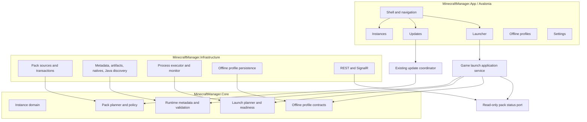

Dependency rules:

- App composes Core contracts and Infrastructure adapters.
- Core references only base .NET libraries and contains no Avalonia, ASP.NET, SignalR, or process API types.
- Pack management does not reference launcher UI or launching implementations.
- Runtime management may reuse generic transport/hash/storage primitives, never pack manifests or update transactions.
- Server adapters return constrained data. Only local launcher code can create a `LaunchPlan`; only the executor can start a process.

## 7. Instance / Runtime / Pack domain model

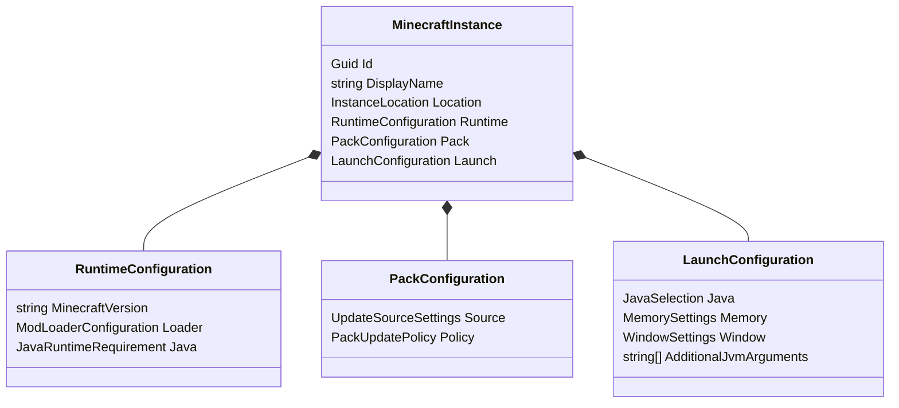

```csharp
public sealed record MinecraftInstance
{
    public required Guid Id { get; init; }
    public required string DisplayName { get; init; }
    public required InstanceLocation Location { get; init; }
    public required RuntimeConfiguration Runtime { get; init; }
    public PackConfiguration? Pack { get; init; }
    public required LaunchConfiguration Launch { get; init; }
    public DateTimeOffset CreatedAtUtc { get; init; }
}

public sealed record InstanceLocation(
    string GameDirectory,
    InstanceOwnership Ownership);

public enum InstanceOwnership { ApplicationOwned, ManagedExternal }

public sealed record RuntimeConfiguration(
    string MinecraftVersion,
    ModLoaderConfiguration? ModLoader,
    JavaRuntimeRequirement Java);

public enum ModLoaderType { Fabric, NeoForge, Forge, Quilt }
public sealed record ModLoaderConfiguration(ModLoaderType Type, string Version);

public sealed record PackConfiguration(
    UpdateSourceSettings Source,
    PackUpdatePolicy UpdatePolicy);

public enum PackUpdatePolicy { Optional, RequiredBeforeLaunch }

public sealed record LaunchConfiguration(
    JavaSelection Java,
    MemorySettings Memory,
    WindowSettings Window,
    IReadOnlyList<string> AdditionalJvmArguments);
```

`MinecraftInstance` is configuration, not mutable installation truth. Installed pack state stays in `InstanceState`; resolved runtime state lives in a runtime ledger. Offline profile data and live process handles are never persisted in the instance. Existing `RootPath` migrates to `Location.GameDirectory`, existing `Source` to `Pack.Source`, and unknown runtime fields cause a guided “configure runtime” state rather than guessed values.

## 8. Runtime management and storage

Default application-data layout:

```text
MinecraftManagerData/
  instances/<instance-id>/game/       # app-owned game directory
  shared/assets/<asset-index>/
  shared/libraries/<maven-path>/
  shared/versions/<version-id>/
  shared/runtimes/<vendor>/<major>/<os-arch>/
  runtime-state/<instance-id>.json
  native-work/<launch-id>/             # per-launch, disposable
  profiles/offline-profiles.json       # local names and stable UUIDs
  state/ transactions/ history/ logs/  # existing pack facilities
```

Assets are content-addressed by Mojang metadata, libraries by normalized coordinate/path plus expected hash, version metadata/JARs by version identity and hash, and managed Java by vendor/version/platform. These immutable verified objects can be shared. Mods, config, saves, screenshots, options, logs, crash reports, and loader-generated mutable files remain instance-specific.

Sharing saves disk and bandwidth but increases cache-index and cleanup complexity. Readers treat shared objects as immutable; installation stages to a temporary file, verifies it, then publishes atomically. Cleanup deletes only unreferenced objects and never follows links. A corrupt shared object invalidates every dependent instance and is repaired once.

Application-owned isolated instances are the long-term default. A managed external instance points at a user-selected `.minecraft`, preserves its ownership and layout, and receives stronger collision warnings. Import does not relocate files without explicit consent. External roots may use their own `assets`/`libraries` where compatibility requires it, while app-owned instances use shared stores by default.

## 9. Minecraft version resolution

```csharp
public interface IMinecraftVersionResolver
{
    Task<ResolvedMinecraftVersion> ResolveAsync(
        RuntimeConfiguration configuration,
        RuntimePlatform platform,
        CancellationToken cancellationToken);
}

public sealed record ResolvedMinecraftVersion(
    string Id,
    string MainClass,
    IReadOnlyList<ResolvedLibrary> Libraries,
    AssetIndexReference AssetIndex,
    IReadOnlyList<LaunchArgumentRule> JvmArguments,
    IReadOnlyList<LaunchArgumentRule> GameArguments,
    IReadOnlyList<NativeArtifact> Natives,
    int RequiredJavaMajor);
```

The resolver loads locally cached, schema-validated version JSON; follows `inheritsFrom` with cycle/depth limits; merges libraries and arguments according to Minecraft rules; evaluates OS/architecture/features rules; selects natives; and returns typed metadata. It does not download, repair, or launch. Network manifest retrieval belongs to `IRuntimeMetadataSource`; `IRuntimeProvisioner` materializes the resolved graph.

Legacy `minecraftArguments` is adapted explicitly for old versions. URLs must be HTTPS and belong to an allowlisted Mojang/Microsoft or configured loader repository policy. Metadata values remain data, never shell fragments.

## 10. Mod-loader runtime integration

One `ModLoaderConfiguration` is shared by instance creation, loader installation, validation, and launch resolution. Existing `IModLoaderInstaller` remains the only component that performs loader installation. Add an adapter/provider contract around it:

```csharp
public interface IModLoaderRuntimeProvider
{
    ModLoaderType Type { get; }
    Task<LoaderRuntimeDescriptor> ResolveAsync(
        RuntimeConfiguration configuration, CancellationToken cancellationToken);
    Task InstallAsync(LoaderInstallRequest request, CancellationToken cancellationToken);
}
```

Fabric, NeoForge, Forge, and Quilt providers translate trusted loader metadata into a normalized descriptor containing inherited version ID, main-class/argument contributions, libraries, and artifacts. The runtime provisioner delegates installation to the existing installer, then the version resolver consumes the resulting descriptor. This wraps rather than replaces installation logic. Version support is added provider by provider; unsupported installer profiles return `InvalidModLoader`, never a best-effort command.

## 11. Java runtime management

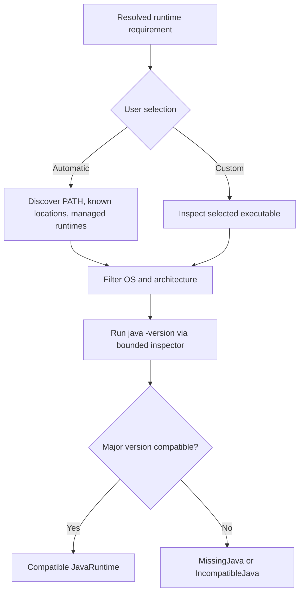

```csharp
public interface IJavaRuntimeService
{
    Task<IReadOnlyList<JavaRuntime>> DiscoverAsync(CancellationToken cancellationToken);
    Task<JavaRuntimeValidationResult> ValidateAsync(
        JavaRuntime runtime,
        JavaRuntimeRequirement requirement,
        RuntimePlatform platform,
        CancellationToken cancellationToken);
    Task<JavaRuntime?> SelectAsync(
        JavaSelection selection,
        JavaRuntimeRequirement requirement,
        RuntimePlatform platform,
        CancellationToken cancellationToken);
}

public sealed record JavaRuntime(
    string ExecutablePath,
    int MajorVersion,
    string Vendor,
    CpuArchitecture Architecture,
    JavaRuntimeOrigin Origin);
```

Compatibility rules belong in a tested `IJavaCompatibilityPolicy`. The resolved official metadata is preferred; a small version-range fallback table is versioned in Core for offline diagnostics. Discovery checks `JAVA_HOME`, `PATH`, well-known platform locations, and managed runtimes, deduplicates canonical paths, and invokes only candidate `java` executables with a timeout. Custom Java is user-selected, canonicalized, inspected, and persisted as a path—not accepted from a server. Architecture must match the OS/process and selected natives. Managed Java download is a later `IJavaRuntimeInstaller` adapter using the runtime artifact pipeline.

## 12. Offline player profiles

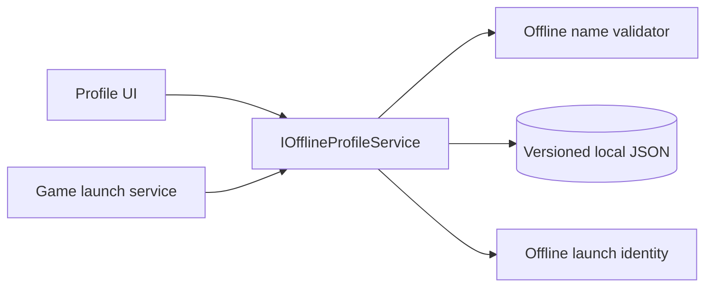

```csharp
public sealed record OfflinePlayerProfile(
    Guid Id,
    string DisplayName,
    Guid OfflinePlayerUuid,
    DateTimeOffset CreatedAtUtc);

public interface IOfflineProfileService
{
    Task<IReadOnlyList<OfflinePlayerProfile>> GetAllAsync(CancellationToken cancellationToken);
    Task<OfflinePlayerProfile> AddAsync(string displayName, CancellationToken cancellationToken);
    Task RenameAsync(Guid profileId, string displayName, CancellationToken cancellationToken);
    Task RemoveAsync(Guid profileId, CancellationToken cancellationToken);
    Task<OfflineLaunchIdentity?> GetLaunchIdentityAsync(Guid profileId, CancellationToken cancellationToken);
}
```

An offline profile contains only a locally chosen player name, an application profile ID, and the stable Minecraft offline UUID derived from `OfflinePlayer:<name>` using the standard name-based UUID algorithm. Implement the byte ordering explicitly and pin it with known test vectors; do not rely on platform-specific `Guid` byte layout. Names are trimmed and validated against the conservative Minecraft username shape and length. Renaming deliberately recomputes the offline UUID and warns that worlds/servers may treat it as a different player. No password, token, browser login, entitlement check, or secure credential store is involved. A managed server cannot create, rename, or select a local player profile.

The launch identity supplies only the locally generated name and UUID plus non-secret compatibility placeholders required by the selected Minecraft version. It works for single-player and servers configured to accept offline-mode identities. It does not prove game ownership, enable Realms, obtain authenticated skins, or make an online-mode server accept the player.

## 13. Launch planning

```csharp
public interface ILaunchPlanner
{
    Task<LaunchPlan> CreatePlanAsync(
        MinecraftInstance instance,
        ResolvedMinecraftVersion runtime,
        JavaRuntime java,
        OfflineLaunchIdentity identity,
        CancellationToken cancellationToken);
}

public sealed record LaunchPlan(
    Guid LaunchId,
    Guid InstanceId,
    string JavaExecutable,
    string MainClass,
    string WorkingDirectory,
    string NativesDirectory,
    IReadOnlyList<string> JvmArguments,
    IReadOnlyList<string> GameArguments,
    IReadOnlyList<string> ClasspathEntries,
    IReadOnlyDictionary<string, string> EnvironmentVariables,
    LaunchLogRedaction Redaction);
```

The immutable plan is built only after validation and has a short lifetime. Classpath remains a structured list so each entry can be canonicalized, boundary-checked, tested, and deduplicated; the executor joins it once using `Path.PathSeparator`. The plan contains no shell command and is never deserialized from remote input. Player-name and UUID placeholders are expanded from the selected local offline identity at planning time.

Required JVM arguments and user additions are separate inputs. A policy rejects or owns conflicting flags such as classpath, native path, agent injection, argument files, and launcher-managed memory flags. Game arguments are not exposed in normal UI; an advanced future editor must use an allowlist and warn that unsupported flags can break identity handling or compatibility.

## 14. Launch validation and readiness

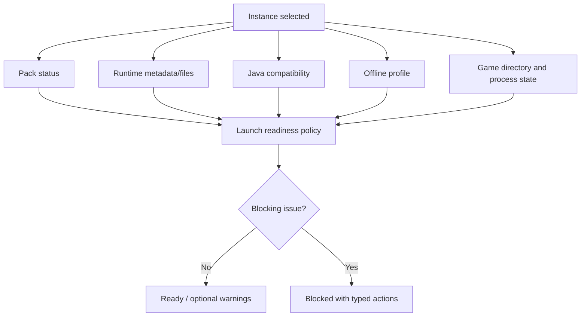

```csharp
public sealed record LaunchReadiness(
    bool CanLaunch,
    IReadOnlyList<LaunchIssue> Issues);

public sealed record LaunchIssue(
    LaunchIssueCode Code,
    LaunchIssueSeverity Severity,
    string MessageKey,
    LaunchRemediation Remediation);

public enum LaunchIssueCode
{
    MissingVersionMetadata, MissingLibraries, MissingAssets, MissingNatives,
    MissingJava, IncompatibleJava, OfflineProfileRequired, InvalidOfflineProfile,
    MissingGameDirectory, InvalidModLoader, PackNotInstalled, PackCorrupted,
    PackUpdateAvailable, RequiredPackUpdate, AlreadyRunning
}
```

The UI derives button/state behavior from issues and remediations, not ad-hoc booleans. Optional pack updates are warnings and permit `PlayCurrent`; required updates, corruption, missing pack, invalid/missing offline profile, Java, runtime, loader, directory, or an already-running instance are blockers. Validation has no repair side effects.

## 15. Process execution

```csharp
public interface ILaunchExecutor
{
    Task<RunningGameProcess> LaunchAsync(LaunchPlan plan, CancellationToken cancellationToken);
}
```

The executor rechecks plan age, instance identity, canonical Java path, file existence, working-directory boundary, and forbidden arguments. It uses `ProcessStartInfo.FileName`, `WorkingDirectory`, `UseShellExecute = false`, and adds each argument through `ArgumentList`. Structured arguments avoid shell parsing and platform-specific quoting bugs. It never invokes `cmd`, PowerShell, Bash, or `/bin/sh`, and never accepts a remote executable path or command line.

Environment variables use a minimal locally generated allowlist. Cancellation before a confirmed start cancels launch preparation; it does not silently kill a process that has started.

## 16. Process monitoring

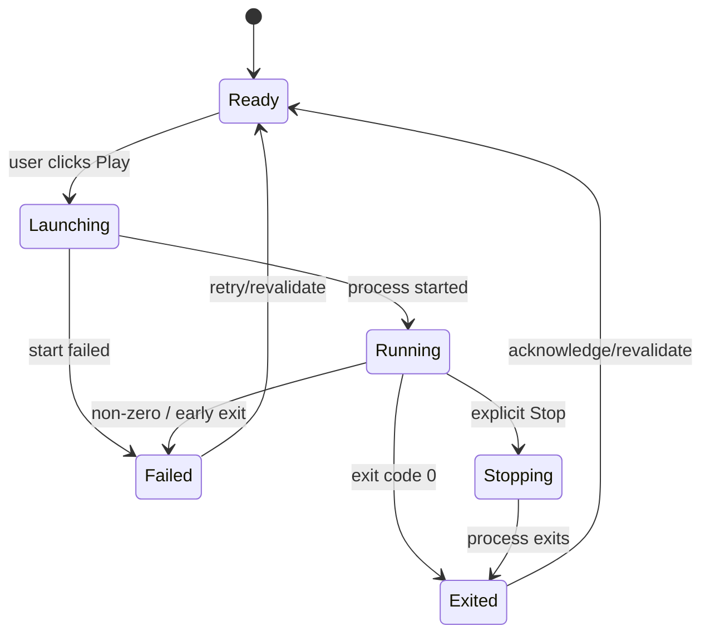

```csharp
public interface IGameProcessMonitor
{
    event EventHandler<GameProcessSnapshot>? Changed;
    GameProcessSnapshot? Get(Guid instanceId);
    Task<RequestStopResult> RequestStopAsync(
        Guid instanceId, StopConfirmation confirmation, CancellationToken cancellationToken);
}
```

`RunningGameProcess` exposes an opaque handle plus PID and start time, not the raw `Process`. Monitoring uses asynchronous exit events, records the exit code, disposes handles, removes native work directories when safe, and revalidates readiness. Stop is optional, explicit, and first requests graceful termination where feasible; force termination needs a second confirmation. A non-zero code means “closed unexpectedly,” not a diagnosed cause.

## 17. Pack manager integration

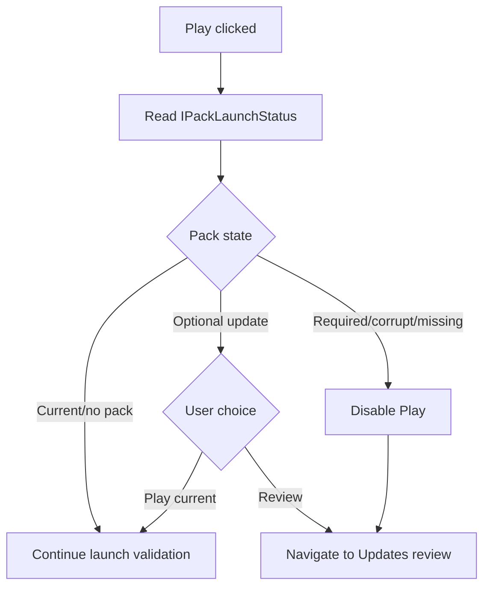

`IPackLaunchStatusService` is a read-only anti-corruption layer over existing installed state and update policy. It returns `None`, `Current`, `UpdateAvailable`, `RequiredUpdate`, `Corrupted`, or `NotInstalled`. Launcher never creates or executes `UpdatePlan`. `Review Update` navigates to Updates with the same instance ID; that screen performs its existing check, immutable review, confirmation, staging, backup, and rollback flow. Even required server policy grants no silent-write authority; declining merely leaves launch blocked.

Pack repair owns `mods/`, managed `config/`, resource packs, shader packs, and explicit managed files. Runtime repair owns version metadata/JARs, libraries, assets, natives, and loader runtime. Neither repair touches saves or other unmanaged user content.

## 18. Managed server integration

The server may provide typed constraints: Minecraft version, loader type/version, pack identity/version, `optional` versus `requiredBeforeLaunch`, minimum client version, and recommended memory/Java major. Required values are validated against allowlisted schemas. Recommendations initialize or annotate local settings but do not override later user choices.

| Server may require | Server may recommend | User controls locally | Forbidden from server |
|---|---|---|---|
| Minecraft/loader/pack versions, minimum client | Java major, RAM | Java path, offline profile, max RAM, resolution, fullscreen | Player identity, executable paths, shell/JVM/game command lines, scripts, environment variables |

REST remains authoritative; SignalR only requests a refresh. Server integration cannot reference `ILaunchExecutor` or process adapters. Server values are data passed through local resolver and validation policies.

## 19. Security boundaries

Core invariants:

- No arbitrary server-triggered process execution.
- Only a canonical, locally discovered or user-selected, compatible Java executable can run.
- Only a locally generated, validated `LaunchPlan` reaches the executor.
- Server and metadata strings are never treated as shell or pre-tokenized command fragments.
- Offline profiles contain no credentials; managed-server credentials remain isolated in the existing protected store and never enter launch arguments.
- Runtime artifacts are HTTPS-downloaded, bounded, staged, and integrity-checked whenever metadata supplies a hash. Missing hashes require an explicit trusted-source policy and are never silently treated as verified.
- User JVM additions cannot replace launcher-owned classpath, native, identity, or memory controls.
- The launcher starts Java, not mods or pack files directly.
- Launch always requires a user gesture; startup and SignalR events cannot trigger it.

The runtime downloader reuses generic retry, progress, cache, staging, and SHA-256 primitives where practical, but uses typed artifact manifests and a runtime ledger. This prevents pack deletion/rollback semantics from leaking into the shared runtime cache.

## 20. Launcher UI architecture

`MainWindowViewModel` evolves into a shell with feature pages. `ISelectedInstanceContext` is a scoped/singleton application-state service with a private setter through `Select(Guid?)`, an observable immutable snapshot, and no filesystem methods. It persists only the last selected ID. Instances, Updates, and Launcher subscribe and reload their own projections; disposal unsubscribes handlers.

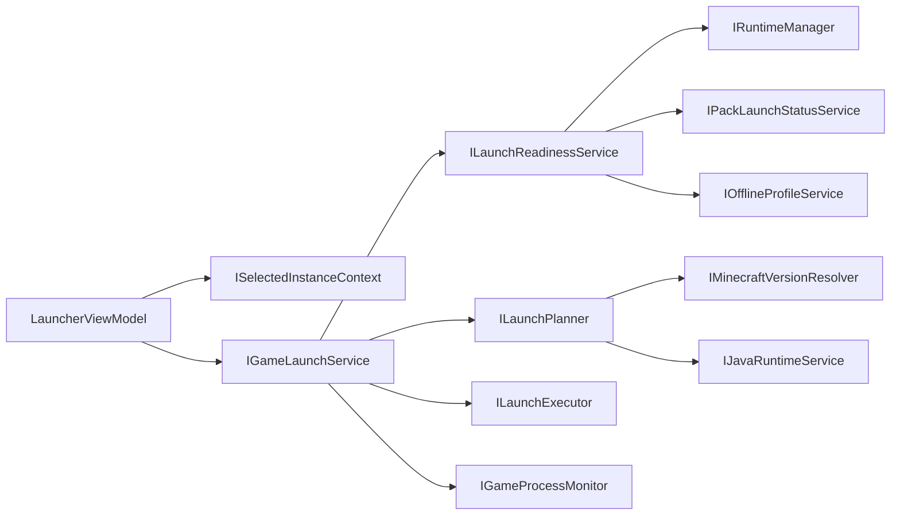

```csharp
public interface ISelectedInstanceContext
{
    Guid? InstanceId { get; }
    event EventHandler<SelectedInstanceChangedEventArgs>? Changed;
    void Select(Guid? instanceId);
}
```

`IGameLaunchService` orchestrates readiness checks, resolves the selected local offline identity and runtime metadata, asks the planner for a plan, executes it, and registers the returned handle with the monitor. It does not implement profile persistence, pack scanning, Java discovery, argument rules, or process creation itself. A keyed async lock prevents two launches of the same instance.

```csharp
public interface IGameLaunchService
{
    Task<LaunchReadiness> CheckReadinessAsync(
        Guid instanceId, Guid? profileId, CancellationToken cancellationToken);
    Task<LaunchResult> LaunchAsync(
        Guid instanceId, Guid profileId, CancellationToken cancellationToken);
}

public sealed record LaunchResult(
    bool Started,
    GameProcessSnapshot? Process,
    LaunchReadiness Readiness,
    LaunchFailure? Failure);
```

## 21. Launcher tab and states

Ready:

```text
Launcher                         [Main Pack v]
Profile  [PlayerOne v] [Manage]  Runtime: Minecraft 1.21.1 / Fabric 0.16
Java: 21 (compatible)            Pack: 3.5.0 current
✓ Ready to launch                         [ PLAY ]
                              [Launch settings]
```

Optional update:

```text
Pack 3.4.0 · 3.5.0 available
[Review Update]                         [Play Current Version]
```

Required update:

```text
Update 3.5.0 is required before launch.  PLAY disabled
[Review Update]
```

Missing runtime:

```text
Minecraft runtime files are missing or damaged.  PLAY disabled
[Repair Runtime]  (pack files and saves are not changed)
```

Missing Java:

```text
Java 21 x64 is required; detected Java 17.  PLAY disabled
[Select Java]
```

Offline profile required:

```text
Choose a local offline player profile.  PLAY disabled
[Manage Offline Profiles]
```

Running:

```text
Minecraft is running · PID 12345 · Main Pack
[Open Instance Folder]  [Stop…]
```

If no instance exists, show `[Create Instance]` and `[Import Existing Installation]`; do not show a disabled empty form. `PLAY` is the sole visual primary action when ready.

## 22. Launch settings UI

```text
Launch Settings — Main Pack
Java    (•) Automatic: Java 21 x64, compatible
        ( ) Custom: [C:\...\java.exe] [Browse]
Memory  Minimum [1024] MB   Maximum [4096] MB
        Recommended 4096 MB · System 16384 MB
Window  (•) Default ( ) Custom [1280] x [720]  [ ] Fullscreen
Advanced
  Additional JVM arguments [one argument per row]
  Game arguments [hidden by default; allowlisted expert option]
                         [Cancel] [Save]
```

Validation requires positive `min <= max`, preserves OS headroom, and warns rather than blindly allocating near-total RAM. Server recommendations are labels/defaults, not forced settings. Runtime-required Java major cannot be overridden. Memory flags are generated by the planner; duplicate user `-Xms`/`-Xmx` values are rejected. Resolution dimensions have sensible bounds, and fullscreen/custom-resolution conflicts are made explicit.

## 23. Offline profiles UI

```text
Offline Profiles
PlayerOne  8c9d…  ✓ Selected                [Use] [Rename] [Remove]
Builder    53a1…                            [Use] [Rename] [Remove]
[Add Offline Profile]
```

Adding or renaming a profile is a local operation. The editor explains that the UUID is derived from the name, that renaming changes player identity, and that offline profiles cannot join online-mode servers or use authenticated services. It never asks for an email, password, token, or Microsoft sign-in.

## 24. Runtime repair UI

```text
Repair Runtime — Main Pack
Missing: 2 libraries, 14 assets
Damaged: 1 version JAR
Loader: Fabric 0.16 metadata present
Download: 38 MB    Existing valid files: 1.2 GB (kept)
This does not modify mods, config, saves, screenshots, or options.
[Cancel] [Repair Runtime]
```

Repair flow:

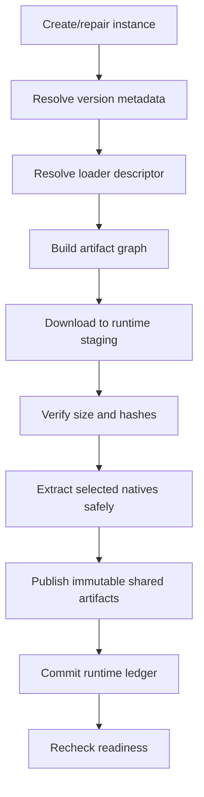

Downloads use HTTPS, bounded redirects/sizes/concurrency, retry with backoff, progress, content-addressed cache, staging, and atomic publication. Archive extraction rejects absolute/traversal/link entries and zip bombs. Native selection evaluates OS/architecture/classifier rules. Per-launch native directories prevent collisions and stale locked DLL/SO files; extraction never writes into arbitrary user paths.

Failure:

```text
Minecraft could not be started.
The Java process exited unexpectedly with code 1.
This exit code alone does not identify the cause.
[Open Logs] [Open Crash Reports] [Launch Again]
Correlation: L-…
```

## 25. MVVM changes

| ViewModel | Responsibility |
|---|---|
| `MainWindowViewModel` | Shell navigation, global banners, selected-instance context |
| `LauncherViewModel` | Instance/profile projections, readiness, primary/remediation commands |
| `LaunchSettingsViewModel` | Draft settings and validation; no command construction |
| `OfflineProfileListViewModel` | Local profile list, select/add/rename/remove |
| `OfflineProfileEditorViewModel` | Name validation and UUID-change warning |
| `RuntimeRepairViewModel` | Runtime-only repair preview/progress/result |
| `GameProcessViewModel` | Process snapshot, open folders/logs, confirmed stop |
| Existing update VMs | Detailed pack review/apply/recovery; unchanged ownership |

Commands include `Play`, `OpenLaunchSettings`, `RepairRuntime`, `ReviewUpdate`, `ManageOfflineProfiles`, and `OpenInstanceFolder`. Async commands cancel on page disposal where safe. Process events are marshalled to the Avalonia dispatcher. Navigation passes IDs, not mutable model instances.

## 26. Project structure changes

```text
src/
  MinecraftManager.App/
    Navigation/ Views/ ViewModels/
    Views/Launcher/ Views/Profiles/ Views/Runtime/
  MinecraftManager.Core/
    Instances/ Packs/ Runtime/ Launching/ Profiles/
    Downloads/                 # capability-neutral contracts only
  MinecraftManager.Infrastructure/
    Runtime/Downloads/ Runtime/Metadata/ Runtime/Java/ Runtime/Natives/
    Launching/Process/ Profiles/ Security/
    Updates/ Sources/ ManagedServer/ Persistence/
tests/
  MinecraftManager.Core.Tests/
  MinecraftManager.App.Tests/
  MinecraftManager.IntegrationTests/
  MinecraftManager.Runtime.Tests/       # add when runtime suite warrants it
  MinecraftManager.Launcher.Tests/      # add when launch suite warrants it
```

Keep the current three production assemblies. Namespace/folder boundaries and dependency tests are sufficient for one developer. Extract `MinecraftManager.Application` only when orchestration becomes shared by another host or Core accumulates infrastructure coordination. Do not create a launcher executable or microservice.

## 27. Cross-platform considerations

| Concern | Windows | Linux |
|---|---|---|
| Java name | `java.exe` | `java` plus executable permission |
| Classpath | `;` (`Path.PathSeparator`) | `:` (`Path.PathSeparator`) |
| Native artifacts | DLL classifiers, locked-file behavior | SO classifiers, executable/read permissions |
| Offline profiles | Versioned local JSON | Versioned local JSON |
| Process | no shell, optional job object later | no shell, signals/process group later |
| Paths | case-insensitive aliases, reparse points | case-sensitive, symlinks |

Runtime platform detection uses `RuntimeInformation`, not string guesses. Paths are canonicalized and passed as individual arguments. Java executable permissions are validated on Linux. ARM64 may use native ARM64 Java and libraries only when metadata/provider support is known; architecture mismatch blocks launch. Environment variables are allowlisted and platform-specific adapters handle any native search path behavior.

## 28. Logging and diagnostics

Record launch ID, instance ID, Minecraft version, loader type/version, Java vendor/major/architecture (not an unnecessary full personal path), timestamp, PID, state transitions, duration, and exit code. Avoid logging offline player names by default, and never log managed-server credentials, environment secrets, usernames/home directories in exported diagnostics, or complete commands.

For v1, redirect stdout/stderr to bounded rolling per-launch files while also relying on `logs/latest.log`; redact known launch secrets before persistence and cap line length/rate. Do not stream a full console into the UI initially. On unexpected exit, link to the game log and crash-report directory, retain a small tail, and state that exit code alone is not a diagnosis.

## 29. Testing strategy

Unit tests cover Java-version/architecture policy, metadata inheritance and rule evaluation, classpath ordering/deduplication, placeholder expansion, forbidden JVM arguments, memory bounds, readiness aggregation, pack-policy decisions, native selection, server-schema rejection, redaction, and all process arguments as discrete values.

Integration tests use fixture metadata and a local HTTP server for downloads, retries, truncation, hashes, caching, offline reuse, archive traversal, and native extraction. Process tests run a harmless fixture Java program (or a test executable through a deliberately separate test adapter), assert working directory/arguments/exit monitoring, and never launch Minecraft routinely. Offline UUID/name validation uses fixed cross-platform test vectors and persistence round trips.

UI tests cover all ten states represented here: ready, optional update, required update, missing runtime, missing Java, offline profile required, running, settings validation, profile management, runtime repair, and launch failure. CI runs Windows/Linux x64; ARM64 gets compilation plus periodic real-host smoke tests.

## 30. Architectural decisions

### ADR-L001 — Launcher remains in the desktop application

**Context:** Users need pack management and launch in one workflow. **Decision:** Extend `MinecraftManager`; no second executable. **Alternatives:** Separate launcher or helper service. **Consequences:** One install and shared selection/composition; feature boundaries must be enforced in code.

### ADR-L002 — Dedicated top-level Launcher tab

**Context:** Launching and update review have different primary actions and states. **Decision:** Add Launcher alongside Updates. **Alternatives:** Add Play to the update page. **Consequences:** Clearer UX and no accidental coupling; shell navigation must be introduced.

### ADR-L003 — Pack manager and launcher stay separate

**Context:** Pack apply mutates managed content transactionally; launch builds and executes a process plan. **Decision:** Integrate through read-only pack status and navigation. **Alternatives:** Expand `UpdateEngine` into a launcher. **Consequences:** Independent tests/repair and preserved safety, with a small orchestration boundary.

### ADR-L004 — `MinecraftInstance` is the shared central object

**Context:** Selection, pack, runtime, and settings refer to the same profile. **Decision:** Evolve the existing record with Runtime, Pack, Launch, and Location. **Alternatives:** Separate unrelated launcher profile. **Consequences:** No duplicate identity; requires versioned JSON migration.

### ADR-L005 — Runtime, Pack, and user state are distinct

**Context:** They have different ownership, sharing, and repair rules. **Decision:** Model and persist separate ledgers/scopes. **Alternatives:** Treat the game directory as one install blob. **Consequences:** Safe targeted repair; more explicit state aggregation.

### ADR-L006 — Generate an immutable `LaunchPlan`

**Context:** Resolution must be reviewable/testable before side effects. **Decision:** Planner returns structured arguments and paths; it never starts Java. **Alternatives:** Build arguments inside process execution/ViewModel. **Consequences:** Deterministic tests and a narrow execution boundary; plans must be short-lived.

### ADR-L007 — Isolate `System.Diagnostics.Process`

**Context:** Process start/exit is platform I/O and security-sensitive. **Decision:** Infrastructure implements `ILaunchExecutor` and monitoring. **Alternatives:** Use Process directly in UI/application service. **Consequences:** Mockable orchestration and centralized validation/disposal.

### ADR-L008 — No arbitrary remote process execution

**Context:** Managed servers can be compromised. **Decision:** Remote protocols contain typed desired state only; local code chooses executable and arguments. **Alternatives:** Remote commands/scripts. **Consequences:** Smaller attack surface; unsupported custom bootstraps cannot run.

### ADR-L009 — REST/SignalR cannot provide executable commands

**Context:** SignalR is transient and REST values are untrusted data. **Decision:** SignalR triggers refresh; REST schemas reject command/path/argument fields. **Alternatives:** Push launch jobs. **Consequences:** No unattended remote launch; server integration remains auditable.

### ADR-L010 — Java management is separate from packs

**Context:** Java is executable runtime state, not managed pack content. **Decision:** Dedicated discovery, policy, selection, and later installation services. **Alternatives:** Ship Java through pack manifests. **Consequences:** Correct trust/compatibility boundary and independent lifecycle.

### ADR-L011 — Local offline profiles only

**Context:** This launcher is intentionally scoped to local/offline play and compatible offline-mode servers. **Decision:** Store only validated local names and deterministic offline UUIDs; do not implement Microsoft/Xbox/Minecraft authentication. **Alternatives:** Official account authentication or ad-hoc credentials. **Consequences:** No launcher account secrets or OAuth complexity, but no ownership verification, Realms, authenticated skins/services, or online-mode server access.

### ADR-L012 — Prefer isolated instances

**Context:** Shared `.minecraft` roots cause version/mod/config conflicts. **Decision:** New instances default to app-owned isolated game directories; external imports remain supported. **Alternatives:** One global `.minecraft`. **Consequences:** Predictable isolation and cleanup at modest disk cost mitigated by shared immutable runtime stores.

## 31. Migration from the existing manager

1. Add configuration schema v2 and a pure migration from `RootPath`/`Source` to `Location`/`Pack`; preserve instance IDs and state ledgers. Migrated instances are `ManagedExternal` and `Runtime` is explicitly unconfigured until the user selects a version.
2. Add shell navigation and `ISelectedInstanceContext`; adapt the current page into Instances/Updates/Servers/History/Settings without changing update behavior.
3. Introduce Core runtime/offline-profile/launch contracts and dependency tests before infrastructure implementations.
4. Extract generic verified-artifact transfer utilities from update infrastructure only when runtime downloading needs them. Existing pack coordinator/executor remain intact.
5. Implement metadata resolution, runtime ledger/validation, Java discovery, launch planning/execution, and fixture tests.
6. Add Launcher UI and local offline-profile management with stable UUID test vectors.
7. Add runtime repair and loader providers incrementally. Existing loader installer remains the mutation path.
8. Extend managed contracts only with versioned typed requirements/recommendations; old servers continue pack-only operation.

Migration is atomic: write a new configuration file via temp/replace and retain a recoverable backup. Failure leaves schema v1 readable. No migration moves or deletes Minecraft files. Existing pack tests remain release gates.

## 32. Implementation roadmap and scenarios

1. **Domain refactor:** instance/runtime/pack/launch records, schema migration, selection context.
2. **Runtime metadata:** Mojang metadata, inheritance, arguments, libraries/assets/natives graph and validation.
3. **Launch engine:** readiness, planner, structured executor, process monitor; test with harmless Java fixture.
4. **Launcher UI:** dedicated tab, selectors, summaries, remediations, running/failure state.
5. **Java management:** discovery, custom selection, compatibility and architecture policy.
6. **Offline profiles:** local add/rename/remove/select workflows and deterministic identity generation.
7. **Runtime install/repair:** verified artifact cache, staging, native extraction, repair UI.
8. **Loader integration:** Fabric, then NeoForge/Forge/Quilt according to fixture/support maturity.
9. **Hardening:** platform smoke tests, crash diagnostics, cache GC, managed-server credential and log-redaction review.

New instance flow is create/import → choose Minecraft version → choose optional loader → assign optional pack → resolve and install runtime → install loader through existing subsystem → review/install pack through Updates → choose offline profile → readiness. None of those setup steps auto-launches.

Launch preparation keeps validation and side effects visible:

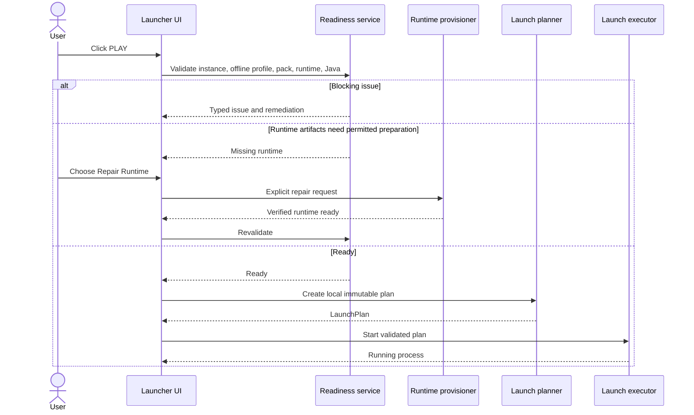

End-to-end play sequence:

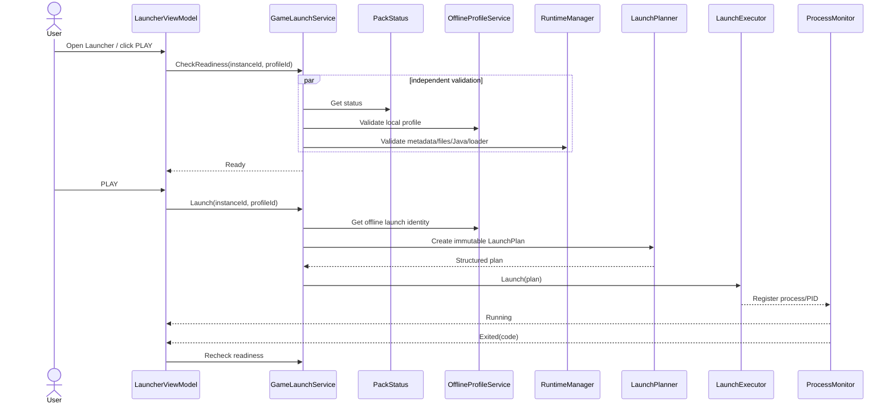

Startup loads offline profiles, instances, runtime/pack state, recovery journals, last selection, and managed-server connections, then validates asynchronously. It never launches Minecraft. The complete user path is therefore: open one app → select Launcher → select instance/profile → resolve explicit readiness actions → press PLAY → monitor Minecraft, while detailed pack work remains in Updates.
