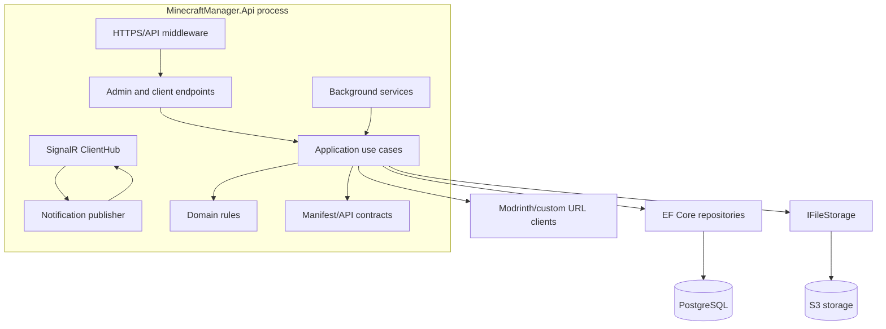
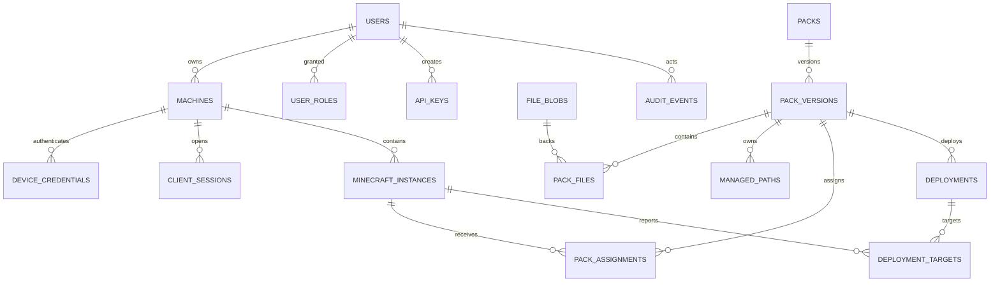
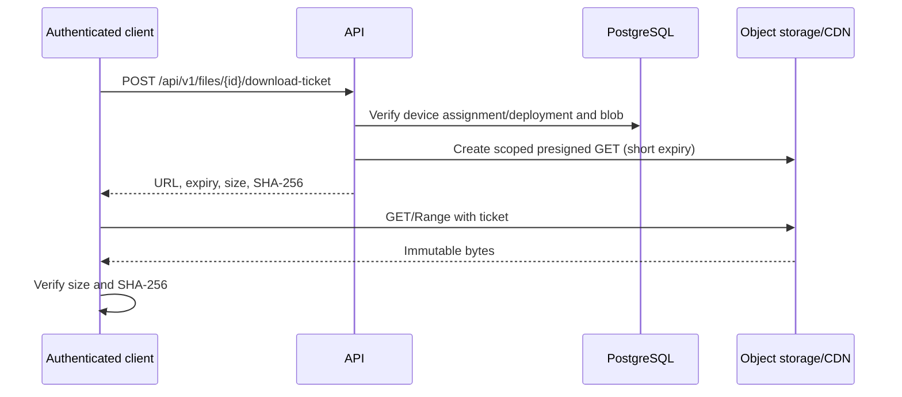
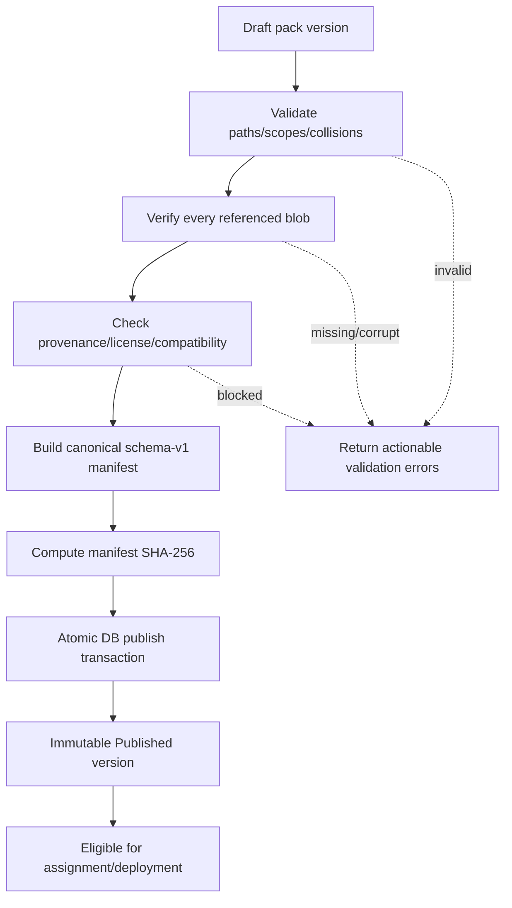
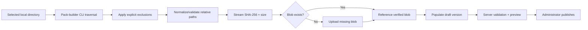
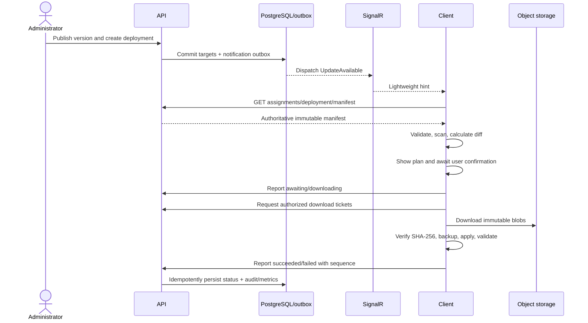
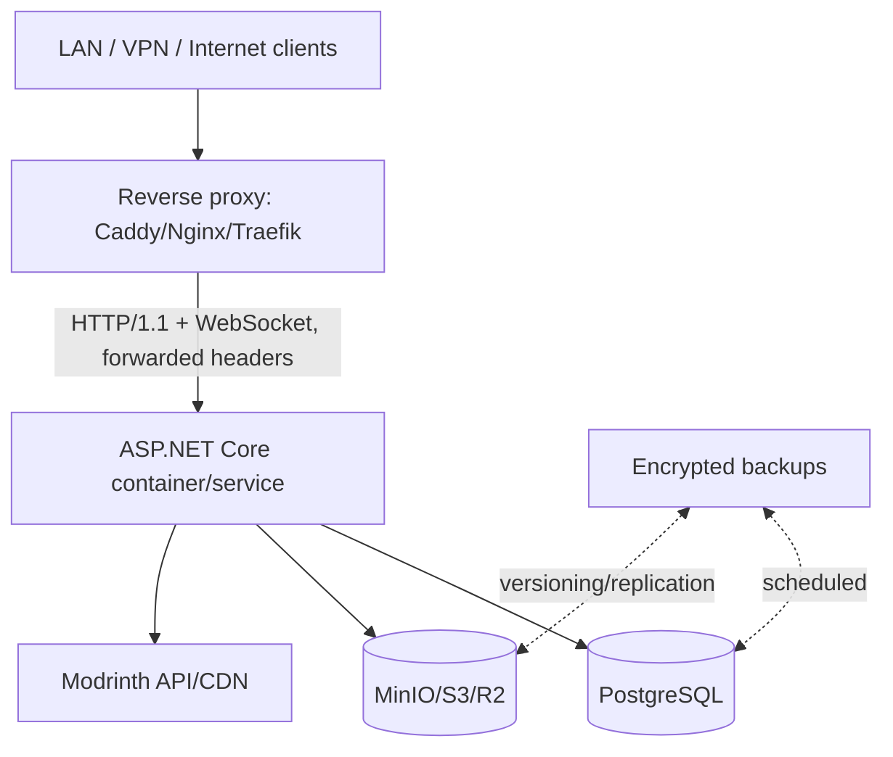

# Minecraft Manager Server Architecture

**Status:** Proposed  
**Audience:** Backend developers, client developers, operators, and security reviewers  
**Related document:** [Client architecture](client-architecture.md)

## 1. Executive summary

Minecraft Manager Server is a small, self-hostable ASP.NET Core service that publishes desired Minecraft pack states to authenticated clients. It stores relational metadata in PostgreSQL, immutable binary content in S3-compatible object storage, exposes an HTTPS REST API as the source of truth, and uses SignalR only to announce that authoritative state should be refreshed.

The service manages versions, assignments, and deployments—not client computers. Its protocol cannot express shell commands, process execution, absolute filesystem paths, or unrestricted deletion. A client retrieves a versioned manifest, independently validates it, calculates a local diff, displays all additions/replacements/deletions, and waits for explicit user confirmation. Server-side validation and authorization complement, but never replace, the client's filesystem boundary.

The initial deployment is one API process, PostgreSQL, and an S3-compatible service such as MinIO, fronted by HTTPS. Redis, a message broker, microservices, and Kubernetes are unnecessary for the expected 10–100 clients. The API and workers can later scale horizontally because PostgreSQL and object storage hold authoritative state; a SignalR backplane or managed SignalR service is added only when multiple live API replicas require cross-node delivery.

## 2. Goals

- Build, validate, publish, assign, and distribute immutable Minecraft pack versions.
- Normalize manually uploaded, locally imported, generated, custom-URL, and Modrinth content into one manifest/file model.
- Register machines and multiple Minecraft instances without collecting absolute local paths.
- Authenticate administrators and devices with revocable, least-privilege credentials.
- Track deployment intent and idempotent client-reported progress without implying remote execution.
- Deduplicate and integrity-check content through SHA-256-addressed object storage.
- Work on public HTTPS, private VPN, and self-hosted LAN networks.
- Remain operable by one developer while preserving a path to thousands of clients.

## 3. Non-goals

Version 1 is not a Minecraft launcher, Minecraft game server host, Microsoft/Mojang identity provider, remote desktop tool, command runner, generic device-management platform, peer-to-peer distributor, or automatic client filesystem controller. It does not synchronize worlds or upload arbitrary client files. It does not require Kubernetes, microservices, Kafka, RabbitMQ, Redis, or a complex workflow engine. A polished browser admin UI may be added later; the server API and a minimal pack-builder CLI are sufficient initially.

## 4. System context and invariants

```mermaid
flowchart LR
    Admin[Administrator / pack-builder CLI] -->|HTTPS admin API| API[ASP.NET Core server]
    Client[Windows/Linux client] -->|HTTPS REST| API
    API -. notification hints .->|SignalR| Client
    API --> DB[(PostgreSQL)]
    API --> S3[(S3-compatible object storage)]
    Client -->|short-lived authorized URL| S3
    Modrinth[Modrinth API/CDN] -->|server-side import| API
    Proxy[Reverse proxy / TLS] --> API
```

The following invariants apply across API design, data model, and operations:

- Published pack versions and their manifests are immutable.
- All manifest paths are normalized relative paths; no operation can name a client root or absolute destination.
- Deletion means omission from a desired version within explicit managed scopes. There is no delete-path command or wildcard purge operation.
- The protocol never contains a command, script, executable action, or arbitrary payload to interpret as code.
- SignalR events are bounded hints. REST is authoritative after reconnect, missed messages, or event reordering.
- Every stored file is identified and verified by its SHA-256 digest and declared byte length.
- A deployment expresses availability/assignment. Only the client user authorizes local modification.
- Server authorization is enforced for metadata and every file download, even if an identifier is guessed.

Static HTTP and local-folder sources can serialize the same manifest schema without ASP.NET types, access tokens, presigned URLs, or SignalR semantics.

## 5. Technology and architecture overview

- C# on a supported modern .NET LTS version, pinned once implementation begins.
- ASP.NET Core Minimal APIs or controllers; use controllers initially where request/response conventions and authorization benefit from explicit actions.
- PostgreSQL with Entity Framework Core and Npgsql.
- S3-compatible object storage through a narrow application adapter.
- SignalR for authenticated notifications.
- `System.Text.Json`, `SHA256`, typed `HttpClient`, OpenAPI, standard configuration/logging/health checks.
- Built-in `BackgroundService` for modest cleanup/import jobs.
- Docker images supporting Linux; native Kestrel service deployment remains supported on Linux and Windows.



Use a modular monolith. HTTP concerns stay in API, use-case coordination in Application, invariants in Domain, wire contracts in Contracts, and external adapters in Infrastructure. This produces testable boundaries without the deployment and consistency costs of microservices.

## 6. Core domain model

```csharp
public sealed class Pack
{
    public Guid Id { get; init; }
    public required string Slug { get; set; }
    public required string DisplayName { get; set; }
    public string? Description { get; set; }
    public bool IsArchived { get; set; }
}

public sealed class PackVersion
{
    public Guid Id { get; init; }
    public Guid PackId { get; init; }
    public required string Version { get; init; }
    public PackVersionState State { get; private set; }
    public int ManifestSchemaVersion { get; init; }
    public string? MinimumClientVersion { get; init; }
    public string? ManifestSha256 { get; private set; }
    public DateTimeOffset? PublishedAtUtc { get; private set; }
    public uint ConcurrencyVersion { get; private set; }
}

public sealed record PackFile(
    Guid PackVersionId,
    string Path,
    Guid BlobId,
    string ContentType,
    JsonDocument? Metadata);

public sealed record StoredBlob(
    Guid Id,
    string Sha256,
    long Size,
    string StorageKey,
    string? ContentType,
    BlobState State);

public sealed class Machine
{
    public Guid Id { get; init; }
    public Guid OwnerUserId { get; init; }
    public required string DisplayName { get; set; }
    public MachineStatus Status { get; set; }
    public DateTimeOffset? LastSeenAtUtc { get; set; }
}

public sealed class MinecraftInstance
{
    public Guid Id { get; init; }
    public Guid MachineId { get; init; }
    public required string ClientInstanceId { get; init; }
    public required string DisplayName { get; set; }
    public string? InstalledPackVersion { get; set; }
}

public sealed class Deployment
{
    public Guid Id { get; init; }
    public Guid PackVersionId { get; init; }
    public DeploymentState State { get; private set; }
    public DateTimeOffset CreatedAtUtc { get; init; }
    public DateTimeOffset? CancelledAtUtc { get; private set; }
}

public enum PackVersionState { Draft, Published, Superseded, Archived }
public enum DeploymentState { Draft, Active, Cancelled, Completed }
public enum TargetStatus
{
    Pending, Notified, Seen, AwaitingUserConfirmation, Downloading,
    Applying, Succeeded, Failed, Declined, Cancelled
}
```

Domain methods, rather than property setters, enforce publish and transition invariants. Draft versions can change. Publishing runs full validation, produces a canonical manifest snapshot/hash, and freezes files and managed paths. `Superseded` and `Archived` change discoverability, not historical content. Rolling back means assigning or deploying an already published older version; it never edits history.

Versions use SemVer 2.0 strings and a tested parser. A database unique constraint prevents two versions with the same normalized semantic version in one pack. Pre-release versions are supported. Build metadata is retained but must not create ambiguous ordering/policy.

## 7. Database design

PostgreSQL stores identities, relationships, lifecycle state, authorization metadata, file metadata, manifests, assignments, deployment status, and audit events. It does not store large file bytes, refresh tokens in recoverable plaintext, access tokens, presigned URLs, or client filesystem paths.



### Major tables

| Table | Purpose and important fields | Keys and constraints | Useful indexes |
|---|---|---|---|
| `users` | Administrator/owner identity: `id`, normalized email/user name, password hash or external subject, enabled, timestamps | PK `id`; unique normalized identity | enabled; external issuer+subject |
| `user_roles` | Role grants such as Owner, PackEditor, Deployer, Auditor | composite PK/FKs `user_id`,`role`; check known role | role |
| `machines` | Registered device: owner, display name, status, OS family/architecture, client version, last seen, revoked time | PK `id`; FK owner; no absolute path | owner+status; last_seen |
| `device_credentials` | Rotatable refresh-credential records: machine, token hash, family/id, expiry, revoked/replaced time | PK `id`; FK machine; unique token identifier; store only keyed/slow hash | machine+active; expiry |
| `client_sessions` | Optional short-lived presence/audit record: machine, issued/last seen/expiry, client version, hashed connection id | PK `id`; FK machine | machine+last_seen; expiry |
| `minecraft_instances` | Multiple client installations: machine, stable client-generated ID, display name, installed pack/version, last seen | PK `id`; FK machine; unique `(machine_id, client_instance_id)` | machine; installed pack; last_seen |
| `packs` | Stable pack identity: slug, name, description, owner/tenant if later needed, archived, timestamps | PK `id`; unique normalized `slug` | archived+name |
| `pack_versions` | Immutable release identity and state: pack, semantic version, schema/min client, manifest JSON/hash, timestamps, concurrency token | PK `id`; FK pack; unique `(pack_id, normalized_version)` | pack+state+published_at |
| `pack_files` | Desired file entry: version, normalized path/key, blob, content type, optional bounded JSON metadata | PK `id`; FKs version/blob; unique `(pack_version_id, normalized_path)` | blob_id; version_id |
| `managed_paths` | Explicit file/directory ownership scope for a version | PK `id`; FK version; unique `(pack_version_id, normalized_path)` | version_id |
| `file_blobs` | Content metadata: SHA-256, length, object key, state, content type, created/verified timestamps | PK `id`; unique `(sha256, size)` and unique storage key | state+created; last referenced |
| `pack_assignments` | Current desired version for an instance: instance, pack/version, assigned by/at, revision | PK `id`; FKs; unique active assignment per `(instance_id, pack_id)` | instance+active; version |
| `deployments` | Administrative rollout intent: pack version, state, creator, timestamps, note | PK `id`; FKs version/creator; concurrency token | state+created; version |
| `deployment_targets` | Per-instance rollout/report state, last status sequence, error code, timestamps | composite/UUID PK; FKs deployment/instance; unique pair | instance+status; deployment+status |
| `api_keys` | Hashed admin/automation key, name, scoped permissions, expiry, last used, revoked | PK `id`; unique public key identifier; never plaintext secret | active/expiry; creator |
| `audit_events` | Append-only admin/security event: actor type/id, action, target, time, correlation, IP hash/prefix if justified, bounded redacted JSON | PK ordered UUID/id; no mutable business FK required | occurred_at; actor; target type/id; action |
| `import_jobs` | Durable local/Modrinth import progress, request parameters, status, retry/error summary | PK `id`; FKs pack/draft version/requester | status+created; version |

Use UUIDs generated by the application (prefer UUIDv7 when supported for index locality) and UTC timestamps. `normalized_path` uses the exact contract normalization (`/`, Unicode policy, no `.`/`..`) and supports uniqueness checks. Because client targets differ in case behavior, publication also rejects case-folded collisions even if PostgreSQL comparison is case-sensitive.

### Entity Framework Core practices

One `MinecraftManagerDbContext` is the initial unit-of-work boundary. Keep migrations in Infrastructure (or API if simpler), reviewed and applied as an explicit deployment step—not automatically by every production replica. Use Fluent configuration, bounded lengths, PostgreSQL check constraints, database-generated concurrency tokens (`xmin` mapping or explicit version), and UTC `DateTimeOffset`.

```csharp
public sealed class PackVersionConfiguration : IEntityTypeConfiguration<PackVersion>
{
    public void Configure(EntityTypeBuilder<PackVersion> b)
    {
        b.ToTable("pack_versions");
        b.HasKey(x => x.Id);
        b.Property(x => x.Version).HasMaxLength(128).IsRequired();
        b.Property<string>("NormalizedVersion").HasMaxLength(128).IsRequired();
        b.HasIndex("PackId", "NormalizedVersion").IsUnique();
        b.Property(x => x.ConcurrencyVersion).IsConcurrencyToken();
        b.HasMany<PackFile>().WithOne().HasForeignKey(x => x.PackVersionId)
            .OnDelete(DeleteBehavior.Restrict);
    }
}

public sealed class PackFileConfiguration : IEntityTypeConfiguration<PackFile>
{
    public void Configure(EntityTypeBuilder<PackFile> b)
    {
        b.ToTable("pack_files");
        b.HasKey("Id");
        b.Property(x => x.Path).HasColumnName("normalized_path").HasMaxLength(1024);
        b.HasIndex(x => new { x.PackVersionId, x.Path }).IsUnique();
        b.HasOne<StoredBlob>().WithMany().HasForeignKey(x => x.BlobId)
            .OnDelete(DeleteBehavior.Restrict);
    }
}
```

Publish within a serializable or carefully locked transaction: re-read the draft, validate every entry/blob/scope, persist canonical manifest and digest, and set Published atomically. Catch `DbUpdateConcurrencyException` and return `409 Conflict` with the current representation. Use projections and `AsNoTracking` for read endpoints, explicit includes only when needed, split queries for large collections, keyset pagination for audit/history, compiled queries only after measurement, and never lazy loading/N+1 loops.

## 8. File storage architecture

Use content-addressed immutable objects:

```text
blobs/sha256/ab/cd/abcdef...full-64-character-digest
```

The object key derives only from a lowercase SHA-256 digest; the database UUID is the public file identifier. Store content length, digest, verification status, media type, source/provenance, and timestamps in PostgreSQL. Treat object metadata as helpful but not authoritative. One `(sha256,size)` row/object can back many pack files and versions.

An upload is never written directly to its final object key. Stream to a temporary key while calculating SHA-256 and enforcing size limits, complete multipart upload, verify length/digest, then copy/promote to the immutable content key or discard it if the verified blob already exists. Conditional creation and a database uniqueness constraint make concurrent identical uploads idempotent. Orphan temporary uploads expire through object-lifecycle rules.

Enable server-side encryption at the storage provider, TLS in transit, private buckets, versioning where operationally affordable, and deny public listing. Application credentials receive only required bucket/prefix actions. Back up database and object data as one logical system; database rows without objects and objects without rows are detected by reconciliation jobs.

### File upload flow

```mermaid
sequenceDiagram
    actor A as Administrator/CLI
    participant API
    participant DB as PostgreSQL
    participant S3 as Object storage
    A->>API: POST upload intent (name, length, optional hash)
    API->>API: Authorize, validate quotas/type
    API->>DB: Create upload record/idempotency key
    API-->>A: Multipart/presigned upload instructions
    A->>S3: Upload to temporary object
    A->>API: Complete upload
    API->>S3: Inspect/read temporary object
    API->>API: Calculate/verify SHA-256 and length
    API->>DB: Find or reserve content digest
    API->>S3: Promote immutable blob or delete duplicate temp
    API->>DB: Mark blob verified; complete upload
    API-->>A: File/blob metadata
```

Small files may stream through the API for simplest v1 implementation. Presigned multipart uploads prevent the API from becoming a bandwidth bottleneck for large packs. In either design the server, not the uploader, verifies content before it can enter a published version.

### Authorized file download



Tickets last about 5–10 minutes, grant GET for one immutable object, and are never logged. The client can request a replacement ticket after expiry. S3/CDN handles range requests and bandwidth; a stable digest/ETag supports safe resume. The API may proxy downloads when presigning or client access to storage is impossible, but direct authorized download is the default at scale. CDN caches immutable digest keys safely, while authorization occurs before ticket issuance (and, for stricter deployments, at an authenticated CDN edge).

Integrity is checked at import/upload, promotion, periodic reconciliation, manifest publication, and client download. SHA-256 is content identity and deduplication, not proof of publisher authenticity. Manifest trust comes from authenticated HTTPS; signed manifests are a later defense-in-depth option aligned with the client architecture.

## 9. Pack construction and version lifecycle

### Lifecycle

1. Create a pack and draft version.
2. Add validated managed scopes.
3. Add files referencing verified blobs from uploads/imports/generated content.
4. Validate paths, collisions, blob availability, license/provenance, sizes, and compatibility.
5. Preview the exact manifest.
6. Publish atomically, freezing manifest and entries.
7. Assign or deploy the version.
8. Mark it superseded when a newer version becomes preferred; archive only to hide it from ordinary selection.

Published versions remain downloadable while assignments, deployment history, or retention policy reference them. Removing a version means a deliberate archival/retention operation with referential checks, never mutating or reusing its semantic version. Rolling back creates a new assignment/deployment targeting an existing old version and is visible in audit history.

### Pack publication flow



## 10. Manifest specification

The shared schema matches the client design and is independent of ASP.NET Core:

```json
{
  "schemaVersion": 1,
  "packId": "main-pack",
  "packVersion": "1.7.0",
  "minimumClientVersion": "1.0.0",
  "managedPaths": [
    "mods/",
    "config/main-pack/",
    "resourcepacks/server-pack.zip"
  ],
  "files": [
    {
      "id": "01K4...",
      "path": "mods/example.jar",
      "size": 123456,
      "sha256": "0123456789abcdef0123456789abcdef0123456789abcdef0123456789abcdef",
      "contentType": "application/java-archive",
      "download": { "type": "server", "fileId": "01K4..." },
      "metadata": { "displayName": "Example Mod" }
    }
  ],
  "metadata": {
    "displayName": "Main Pack",
    "releaseNotes": "Performance and configuration update"
  }
}
```

`id` and `download` are optional source-binding extensions; a static export can omit `id` and use relative `files/<path>` resolution. Executable flags are intentionally absent in v1: Minecraft pack content is data and the client never grants executable permission or runs it. Generated configuration is materialized as normal immutable bytes before publication.

### Canonical rules and limits

- UTF-8 JSON, camelCase fields, ISO-8601 UTC timestamps where present, and lowercase 64-hex SHA-256.
- Paths use `/`, contain non-empty segments, and are relative. Reject leading separators, `.`, `..`, NUL/control characters, `:`, drive/UNC/device paths, backslash ambiguity, Windows reserved names/trailing aliases, and excessive length/depth.
- Reject exact, Unicode-normalized, and case-folded path collisions so one manifest behaves safely on Windows and Linux.
- Every file falls within at least one managed scope; scopes cannot be root, overlap protected defaults, contain wildcards, or ambiguously overlap one another.
- Enforce configured limits for manifest bytes, number of files/scopes, individual/aggregate size, metadata depth/size, and path length.
- Unknown schema versions and unknown required capabilities block publication/consumption.

Canonical serialization is deterministic property ordering and normalized values, used to calculate `ManifestSha256` and ETag. Consumers must not rely on raw JSON whitespace/order for semantic equality unless verifying a future signature over specified canonical bytes.

### Safe deletion semantics

There are no deletion entries. The desired file list plus `managedPaths` tells the client what the published version owns. The client computes deletion only from its last successfully installed managed-file ledger minus desired files and shows those paths before confirmation. The server rejects broad/protected scopes and highlights scope expansion during publication/deployment, but final enforcement remains client-side. Never emit `**`, root scopes, arbitrary filesystem paths, or “delete everything else.”

## 11. Imports

### Local directory/admin upload



Prefer a local pack-builder CLI rather than giving the server arbitrary access to server-host filesystem paths. The CLI receives an explicitly selected root, does not follow symlinks/junctions, emits only regular files, applies visible exclusions (`saves`, logs, VCS/build artifacts by default), normalizes paths, hashes streams, and asks the API which digests already exist before upload. Exclusions are exact/prefix rules—not unrestricted deletion rules—and the administrator reviews them and chooses managed scopes.

Uploads use idempotency keys and resumable multipart transfer where worthwhile. A server-side import job assembles references only after all blobs verify. Drafts may remain incomplete; publication cannot. Concurrent duplicate digest uploads converge on one blob. Generated config follows the same byte/hash/upload pipeline.

### Custom URL import

Custom URL fetching is an administrator-only server action with SSRF defenses: allow HTTP(S) only, resolve and validate every redirect, reject loopback/link-local/private destinations unless explicitly allowlisted for a trusted LAN deployment, limit redirects/bytes/time, pin resolved-address policy through the request, and do not forward server credentials. The fetched response becomes a verified internal blob; clients never follow the custom URL.

### Modrinth integration

`IModrinthService` uses a named typed `HttpClient`, identifies the application as required by upstream policy, rate-limits requests, caches bounded project/version metadata, and supports searching projects plus selecting an exact version compatible with chosen Minecraft/loaders. Import verifies upstream-provided hashes when available and always calculates SHA-256, records project/version/file identifiers and license/provenance, then stores or references the normalized blob.

| Option | Advantages | Disadvantages |
|---|---|---|
| Client downloads from Modrinth | Server saves storage/bandwidth | Couples every client to upstream API, availability, auth/rate limits, and changing metadata |
| Server proxies each download | Central policy and no redistribution-at-rest | Server bandwidth bottleneck; upstream outage affects installs |
| Server imports to object storage | Reproducible immutable builds, deduplication, fast/client-simple downloads | Storage/bandwidth cost and redistribution/license obligations |

Default to import into object storage only when the artifact's license and Modrinth/project distribution terms permit it. Store attribution and license evidence at import time and expose required notices. If redistribution is not permitted, either reject inclusion in managed packs or later support an explicit upstream-download descriptor with its weaker availability guarantees; do not silently cache prohibited content. The client should not need the Modrinth API for the normal path.

Metadata refresh can update draft search information, never a published manifest/blob. Upstream version deletion therefore cannot silently mutate an installed target.

## 12. Client registration and privacy

Distinguish four identities:

- **User:** human administrator/owner and authorization subject.
- **Machine:** registered OS device with one revocable credential family.
- **Minecraft instance:** client-generated stable ID for one configured installation; a machine can have many.
- **Client session:** short-lived authenticated connection/presence record, not installation identity.

```mermaid
sequenceDiagram
    actor U as User/Admin
    participant C as Client
    participant API
    participant DB as PostgreSQL
    U->>API: Create one-use registration code
    API->>DB: Store hashed code, scope, short expiry
    API-->>U: Display code/QR out of band
    U->>C: Enter/scan registration code
    C->>API: POST /api/v1/client-registrations/complete
    API->>DB: Atomically consume code; create machine + credential
    API-->>C: machineId, access token, refresh credential
    C->>API: PUT instance (clientInstanceId, display name, OS/client info)
    API->>DB: Upsert instance owned by machine
    API-->>C: server instance ID and assignments
    C->>API: Connect SignalR with short-lived access token
```

Registration codes are cryptographically random, one-use, scoped to an owner/server, short-lived (for example 10 minutes), rate-limited, and stored hashed. An admin may also pre-provision a device through a similarly scoped flow.

The client reports random instance ID, friendly name, OS family, architecture, client version, assigned/installed pack version, status, and last-seen time. It does not report absolute Minecraft path, username/home, saves, screenshots, unmanaged file inventory, or file contents. A local “path identifier” is unnecessary; if duplicate instance diagnosis is needed, use the client-generated random ID.

## 13. Authentication and authorization

### Administrators

For a future same-origin web admin UI, use ASP.NET Core Identity with secure, HTTP-only, SameSite cookies, antiforgery protection, lockout, MFA support, and strong password hashing. CLI/automation uses scoped API keys or OAuth/OIDC access tokens if an external identity provider is introduced. Store API-key hashes, show the secret once, support expiry/rotation/revocation, and audit use. Do not use long-lived JWTs as browser storage.

Initial roles/policies:

- `Owner`: server configuration and administrators.
- `PackEditor`: create/edit drafts and imports.
- `Publisher`: publish immutable versions.
- `Deployer`: assignments/deployments/cancellation.
- `MachineManager`: view/revoke machines.
- `Auditor`: read metadata/audit without secrets.

Small deployments can grant all roles to one owner while retaining policy boundaries in endpoints.

### Clients

After one-use registration, issue a short-lived signed access token (roughly 10 minutes) and a high-entropy rotating refresh credential. Store only a server-side hash of the refresh credential. Bind its subject to one machine and include a credential/session ID, audience, issuer, issued/expiry times, and authorization version. On refresh, rotate the token; replay of an already rotated token revokes the credential family and requires registration again.

Clients can manage only their own instance metadata, see their own assignments/deployments, download blobs reachable through those assignments, report their own target status, and join SignalR groups for their machine/instances. They cannot enumerate packs/files/machines globally. Revoking a machine invalidates refresh credentials, increments authorization version, denies ticket creation/hub reconnect, and publishes no further data. Short access-token lifetime bounds propagation delay.

Protect authentication endpoints with rate limits, generic failure responses, UTC expiry checks, HTTPS, key rotation, and server clock monitoring. `jti`/credential-family checks and refresh rotation mitigate replay. Idempotency and monotonic report sequence numbers protect state-changing business endpoints; JWT replay storage for every ordinary GET is unnecessary.

## 14. REST API

All routes are versioned under `/api/v1`. JSON uses camelCase and RFC 7807 Problem Details (`type`, `title`, `status`, stable `code`, `traceId`, safe details). OpenAPI documents schemas, security, examples, statuses, idempotency headers, and deprecations. Do not expose EF entities directly.

### Client endpoints

| Method and route | Purpose | Authentication | Typical statuses |
|---|---|---|---|
| `POST /client-registrations/complete` | Consume one-time code; create machine credential | Registration code in body; rate-limited | 201, 400, 409, 410, 429 |
| `POST /client-sessions/token` | Rotate refresh credential/get access token | Refresh credential | 200, 401, 409, 429 |
| `PUT /client/instances/{clientInstanceId}` | Idempotently register/update own instance metadata | Device access token | 200/201, 400, 401, 409 |
| `POST /client/heartbeat` | Presence/version summary | Device token | 204, 400, 401, 429 |
| `GET /client/assignments` | Authoritative current assignments, supports ETag | Device token | 200, 304, 401 |
| `GET /client/deployments` | Page own deployment targets | Device token | 200, 401 |
| `GET /client/deployments/{id}` | Own target and pack reference | Device token | 200, 404 |
| `POST /client/deployments/{id}/status` | Idempotent monotonic status report | Device token | 200, 400, 404, 409 |
| `GET /packs/{packId}/versions/{version}/manifest` | Assigned/authorized immutable manifest | Device or authorized admin | 200, 304, 403, 404, 426 |
| `GET /files/{fileId}` | Authorized metadata | Device/admin | 200, 403, 404 |
| `POST /files/{fileId}/download-ticket` | Short-lived scoped object URL | Device/admin | 200, 403, 404, 503 |

Registration request and response:

```http
POST /api/v1/client-registrations/complete
Content-Type: application/json

{"registrationCode":"correct-horse-...","displayName":"DESKTOP-ABC"}
```

```json
{
  "machineId": "0194f09d-7dc1-7ca0-99f8-1b802f2bd83e",
  "accessToken": "<short-lived>",
  "accessTokenExpiresAtUtc": "2026-09-06T12:10:00Z",
  "refreshCredential": "<shown once>"
}
```

Do not cache this response or log its body. An invalid/used/expired code returns generic Problem Details without confirming other server data.

Status report:

```http
POST /api/v1/client/deployments/0194.../status
Authorization: Bearer <access-token>
Idempotency-Key: 9cb...
```

```json
{
  "clientInstanceId": "447a36c4-5ed7-484e-974b-a0b94c81a6ec",
  "sequence": 4,
  "status": "applying",
  "clientTimestampUtc": "2026-09-06T12:22:15Z",
  "error": null
}
```

The server records receipt time as authoritative, validates instance ownership and allowed transition/sequence, and returns the current representation on duplicates. Errors use stable categories and bounded text; clients must not send absolute paths or raw logs.

Manifest responses are immutable and include `ETag: "sha256-..."`, `Cache-Control: private, max-age=...`, and `X-Content-Type-Options: nosniff`. Return `426 Upgrade Required` with minimum client version when known incompatible, though the client also validates the manifest field.

### Administrative endpoints

| Method and route | Purpose | Policy |
|---|---|---|
| `GET /admin/packs` / `GET /admin/packs/{id}` | Page/search packs and inspect metadata | PackEditor/Publisher/Deployer |
| `POST /admin/packs` / `PATCH /admin/packs/{id}` | Create/update pack metadata | PackEditor |
| `GET /admin/packs/{id}/versions` / `GET /admin/pack-versions/{id}` | Page versions and inspect a draft/published version | PackEditor/Publisher/Deployer |
| `POST /admin/packs/{id}/versions` | Create draft | PackEditor |
| `PUT /admin/pack-versions/{id}/managed-paths` | Replace draft scopes with concurrency token | PackEditor |
| `POST /admin/pack-versions/{id}/files` | Attach verified blob to draft path | PackEditor |
| `GET /admin/pack-versions/{id}/manifest-preview` | Validate/preview exact output | PackEditor/Publisher |
| `POST /admin/pack-versions/{id}/publish` | Atomically publish immutable version | Publisher |
| `POST /admin/uploads` | Create idempotent upload intent | PackEditor |
| `POST /admin/uploads/{id}/complete` | Verify/promote content | PackEditor |
| `GET /admin/files/{id}` | Inspect verified blob metadata and references | PackEditor |
| `POST /admin/imports/modrinth` | Start bounded import to a draft | PackEditor |
| `POST /admin/assignments` | Set desired version for instances | Deployer |
| `POST /admin/deployments` | Create activation + target snapshot | Deployer |
| `POST /admin/deployments/{id}/cancel` | Cancel pending/nonterminal targets | Deployer |
| `POST /admin/machines/{id}/revoke` | Revoke credential family | MachineManager |
| `GET /admin/audit-events` | Keyset-paged audit | Auditor |

Draft mutations require `If-Match`/concurrency tokens. Publish and deployment creation require an `Idempotency-Key`; reuse with a different request hash returns 409. Creation returns 201 with `Location`; asynchronous import returns 202 and job location; invalid semantic state is 409; validation failures are 422; absent/hidden unauthorized resources generally return 404 to reduce enumeration.

Deployment creation example:

```json
{
  "packVersionId": "0194...",
  "targetInstanceIds": ["0195...", "0196..."],
  "note": "September performance update"
}
```

The transaction snapshots only authorized, existing targets and creates `Pending` target rows. After commit, notification dispatch is driven by an outbox record so a crash cannot lose the durable deployment.

## 15. SignalR protocol

Expose `/hubs/client-events`, authenticate with the same short-lived device access token, cap message/connection rates and sizes, and place connections in server-derived `machine:{id}` and `instance:{id}` groups. Never accept a client-provided group identity. WebSocket, Server-Sent Events, or long polling transports may be enabled as infrastructure permits.

```csharp
public interface IClientEvents
{
    Task UpdateAvailable(UpdateAvailableEvent message);
    Task PackAssignmentChanged(PackAssignmentChangedEvent message);
    Task DeploymentCancelled(DeploymentCancelledEvent message);
    Task RefreshRequested(RefreshRequestedEvent message);
    Task ServerNotice(ServerNoticeEvent message);
}

public sealed record UpdateAvailableEvent(
    Guid EventId, Guid InstanceId, Guid DeploymentId,
    string PackId, string PackVersion, DateTimeOffset OccurredAtUtc);
public sealed record PackAssignmentChangedEvent(
    Guid EventId, Guid InstanceId, long AssignmentRevision, DateTimeOffset OccurredAtUtc);
public sealed record DeploymentCancelledEvent(
    Guid EventId, Guid InstanceId, Guid DeploymentId, DateTimeOffset OccurredAtUtc);
public sealed record RefreshRequestedEvent(
    Guid EventId, string Reason, DateTimeOffset OccurredAtUtc);
public sealed record ServerNoticeEvent(
    Guid EventId, string Severity, string Message, DateTimeOffset ExpiresAtUtc);
```

Events contain no manifest, binary, URL, token, filesystem path, or executable instruction. Clients deduplicate by event ID if useful, debounce/coalesce refreshes, and always GET assignments/deployments/manifests. A cancellation notification cannot interrupt a client's critical filesystem phase; it prompts an authoritative refresh and the client follows its safe state machine.

Write notifications through a transactional outbox created with the business change. A single-instance `BackgroundService` reads unpublished rows with `FOR UPDATE SKIP LOCKED`, delivers to connected groups, and marks attempts. Delivery is at least once; correctness does not depend on receipt. This modest outbox avoids a broker while preventing commit/notify gaps.

## 16. Deployment workflow

A `Deployment` is server intent for one immutable pack version and a snapshot of target instances. Its aggregate state is server-owned: Draft/Active/Cancelled/Completed. Each `DeploymentTarget` stores a server-owned lifecycle record whose progress values are client-reported facts.

Allowed target progression is normally:

```text
Pending -> Notified -> Seen -> AwaitingUserConfirmation
        -> Downloading -> Applying -> Succeeded
                                 \-> Failed
AwaitingUserConfirmation -> Declined
nonterminal -> Cancelled (server intent; client acknowledges when safe)
```

`Notified` means a delivery attempt was recorded, not that the client received it. `Seen` may be inferred when the client fetches the deployment. The client reports confirmation/download/apply outcomes with a monotonic sequence. The server never claims it performed those actions and does not force progress. Terminal reports are immutable except an explicit new retry attempt/target-attempt record; preserve previous failure history.



Assignments represent current desired state and survive deployment history. A deployment can target current assignment changes or announce an already assigned version. Cancelling prevents new work and notifies clients, but cannot guarantee undoing a user-confirmed update already applying; the UI/API must state this limitation.

## 17. Security model

| Threat | Server controls | Client boundary still required |
|---|---|---|
| Malicious manifest/path traversal | Strict shared validator, protected scopes, immutable preview/publish | Revalidate paths, containment, links, collisions |
| Compromised administrator | RBAC, MFA, audit, separation of publish/deploy, rate/size limits | Show exact diff and require confirmation |
| Compromised server | Least-power declarative schema; no command vocabulary | Managed ledger, path boundary, never execute files |
| Unauthorized blob download | Device ownership/assignment authorization, scoped expiring ticket | Verify expected hash/size |
| Stolen device token | Short access lifetime, rotating refresh, family revocation | OS secure credential store |
| Malicious upload | Quarantine/temp object, size/hash/type validation, optional malware scan | Treat content as data; never execute |
| Symlinks/local overwrite | Server refuses link/archive path constructs | Client checks real filesystem ancestors |
| Replay/duplicate reports | Rotation, expiry, idempotency keys, monotonic sequence | Idempotent client operations |
| SignalR abuse | Authenticated derived groups, allowlisted events, limits | Treat every event as refresh hint |
| SSRF through imports | Scheme/address/redirect/size/timeout policy | No direct custom URL in normal manifest |
| Denial of service | Rate/body/query limits, quotas, pagination, bounded workers, storage lifecycle | Bounded manifest/download processing |

Use ASP.NET Core authorization policies on endpoints and repeat resource-level ownership checks inside use cases. Configure request body and multipart limits per route, output pagination caps, timeouts/cancellation, rate limiting by account/device/IP, CORS only for known admin origins, antiforgery for cookie-authenticated mutations, secure headers, and no detailed production exceptions.

File type/content scanning may flag known malware but cannot determine whether a mod is safe; hash/provenance and administrator review remain central. Uploaded archives are not blindly extracted server-side. If a pack-builder accepts an archive, it applies zip-slip, entry-count, expansion-ratio, total-size, symlink, and path validation before upload.

Signing manifests is optional later hardening. It requires offline/limited publishing keys, canonical bytes, `keyId`, rotation/revocation, and downgrade rules. HTTPS plus authenticated authorization is the v1 trust mechanism; SHA-256 by itself is not authentication.

## 18. Failure handling and idempotency

| Failure | Behavior |
|---|---|
| PostgreSQL unavailable | Readiness fails; state-changing/read APIs needing DB return 503; do not claim success or issue unauthorized tickets |
| Object storage unavailable | Metadata endpoints may remain available; upload/ticket/download-proxy paths return retryable 503; publication rejects unverified blobs |
| Client disconnects | Deployment remains durable; status becomes stale, not failed; client refreshes authoritative state on reconnect |
| Upload interrupted | Multipart/temp object remains quarantined and expires; completion is retryable/idempotent |
| Import incomplete | Draft/job remains Failed or retryable; no partial publication; verified blobs may be reused |
| SignalR disconnect/outage | REST continues; outbox retries; clients poll/refresh; no correctness loss |
| Duplicate status | Same idempotency key/request returns prior result; repeated sequence is ignored/acknowledged; conflicting sequence returns 409 |
| Manifest build fails | Publish transaction rolls back; draft and validation diagnostics remain |
| Notify after commit fails | Outbox retries with backoff; deployment is discoverable through REST meanwhile |
| API crashes during import | Durable job checkpoint resumes/retries safely or marks failed; temp objects reconcile later |

Idempotency records store caller, key, normalized request hash, response reference/status, and expiry. Use them on registration completion, upload completion, publish, assignment, deployment creation/cancel, and status reporting where retries are expected. Database transactions cover related metadata only; object-store workflows are sagas with explicit temporary/verified states and compensating cleanup, never pretend to be cross-system ACID.

## 19. Background processing

Initial `BackgroundService` jobs:

- Transactional-outbox delivery with bounded retry/backoff.
- Expired client session/registration/idempotency cleanup.
- Temporary/incomplete upload cleanup coordinated with bucket lifecycle.
- Conservative orphan-blob marking and delayed deletion after reference recheck.
- Import-job execution/checkpointing if imports are accepted asynchronously.
- Optional Modrinth metadata refresh for drafts only.
- Audit retention/export according to policy.
- Low-frequency blob reconciliation/verification sampling.

Persist every durable job in PostgreSQL. Use PostgreSQL advisory locks or `FOR UPDATE SKIP LOCKED` so one or several API processes do not duplicate exclusive work. Jobs are idempotent, observe cancellation on shutdown, expose age/failure metrics, and cap concurrency.

A dedicated queue becomes justified when imports are numerous/long-running, API and workers must scale independently, retry/dead-letter requirements exceed the database job table, or PostgreSQL polling becomes measurable load. At that point select the smallest operationally acceptable queue. Do not introduce a broker preemptively.

## 20. Observability and audit

Use structured `ILogger` logs with request/correlation ID, authenticated subject/machine ID, route, result, duration, pack/version/deployment IDs, job/attempt ID, and safe error code. Propagate W3C trace context to PostgreSQL instrumentation, S3, and Modrinth using OpenTelemetry. Start with console JSON logs; add Serilog only if its sinks/rolling behavior are required.

Never log passwords, registration codes, API keys, refresh/access tokens, authorization/cookie headers, presigned URLs/query strings, upload bytes, manifest contents by default, or client absolute paths. Redact centrally before request logging. Treat display names and IP addresses as potentially personal; restrict and retain them deliberately.

Health endpoints:

- `/health/live`: process/event-loop alive; no dependency calls.
- `/health/ready`: PostgreSQL reachable/migrated and required configuration valid; object storage can be a required or degraded readiness dependency based on route-splitting policy.
- `/health/startup`: migrations/schema and startup initialization complete.

Metrics include request rate/latency/errors, active SignalR connections, auth failures/rate limits, outbox backlog/age, import duration/failures, upload/download-ticket counts, deployment target states/staleness, DB pool saturation, and object-storage latency. Avoid high-cardinality machine/file IDs as metric labels.

`audit_events` are append-only and record `event_id`, occurred time, actor type/ID, action, target type/ID, correlation ID, outcome, and bounded redacted JSON details. Audit pack creation/edit, version publish/archive, uploads/imports, assignment/deployment/cancel, machine/API-key registration/revocation, role/security changes, and diagnostic exports. Application roles cannot update/delete audit rows; retention/export is a privileged operational task. Audit is evidence, not a replacement for logs or current relational state.

## 21. Configuration and secrets

Use layered .NET configuration: committed `appsettings.json` for safe defaults, environment-specific non-secret overrides, environment variables/command-line for deployment, user secrets during development, and Docker/Kubernetes-style mounted secret files or a cloud secret manager in production. Validate strongly typed options at startup with `ValidateOnStart`.

```json
{
  "ConnectionStrings": { "Database": "<from secret source>" },
  "ObjectStorage": {
    "ServiceUrl": "https://minio.internal",
    "Bucket": "minecraft-manager",
    "Region": "local",
    "ForcePathStyle": true
  },
  "Authentication": {
    "Issuer": "https://updates.example.com",
    "Audience": "minecraft-manager-client",
    "AccessTokenMinutes": 10
  },
  "Downloads": {
    "TicketMinutes": 5,
    "MaximumFileBytes": 2147483648
  },
  "Imports": {
    "MaximumFilesPerVersion": 10000,
    "MaximumConcurrentJobs": 2
  },
  "SignalR": { "MaximumReceiveMessageSize": 16384 }
}
```

Database passwords, S3 access/secret keys, JWT signing/private keys, Modrinth credentials if any, initial owner bootstrap secret, and API keys never enter configuration committed to source. Rotate independently; support multiple verification keys during token/signature rollover.

## 22. Deployment architecture



Recommend Linux plus Docker Compose for small production deployments: reverse proxy, API/worker, PostgreSQL, and optionally MinIO when external S3/R2 is not used. Pin image versions, run as a non-root user with read-only root filesystem where practical, use a writable temp volume, add resource limits/health checks, and persist only database/storage data. Do not bake secrets into images. Native Linux systemd or Windows Service hosting uses the same Kestrel application and external PostgreSQL/S3.

Terminate public HTTPS at the reverse proxy, configure trusted forwarded headers explicitly, redirect HTTP, support WebSocket upgrades/timeouts, cap request sizes, and encrypt backend links when they cross hosts/untrusted networks. Caddy is a convenient default for automatic public TLS; Nginx/Traefik are equally valid when already operated.

Backups require both PostgreSQL (regular logical/physical backups plus tested point-in-time recovery if needed) and object storage (versioning/replication or provider durability). Record a consistency watermark; regularly test restore into an isolated environment. Losing either side can make versions incomplete.

### Self-hosted LAN/VPN

Bind Kestrel/reverse proxy to an explicit LAN interface, open only required firewall ports, and keep PostgreSQL/MinIO off untrusted interfaces. Prefer a stable local DNS name over a raw IP. Publicly trusted TLS works with a controlled domain/DNS challenge; otherwise install a private CA root on clients. Never tell clients to disable certificate validation globally. Plain HTTP can be an explicit LAN-only development/small-home option with prominent warnings, but device credentials are exposed to local attackers and it is not recommended.

Server discovery is optional and manual URL entry is safest for v1. Future mDNS can advertise only service name/URL/fingerprint, never credentials, and the user must confirm it. VPN addresses through WireGuard/Tailscale behave like other network routes and still require authentication/TLS policy.

## 23. Scalability

For 10–100 clients, one modest API instance, PostgreSQL, and S3/MinIO are sufficient. Immutable manifests receive ETag/cache benefits, downloads bypass the API through presigned storage URLs, heartbeat intervals use jitter, and bounded pagination/import concurrency prevents spikes. Redis adds no value here.

Toward thousands of clients:

- Keep HTTP endpoints stateless; add API replicas behind a load balancer.
- Continue keeping durable assignment/deployment/outbox/job state in PostgreSQL; tune indexes, pooling, queries, retention, and read replicas only when measured.
- Put immutable blob delivery behind an object-store CDN; never proxy bulk bytes through API replicas unnecessarily.
- Stagger/jitter client reconnect, polling, and token refresh to avoid thundering herds.
- Separate workers from API processes when imports/outbox/cleanup contend for resources.
- Partition large audit/session/status-history tables by time only after size/maintenance warrants it.
- For multi-replica SignalR, add Redis backplane or a managed SignalR service and verify group/auth semantics. REST remains correct if real-time delivery is delayed.

PostgreSQL and object storage are shared state. The API, manifest builder, import workers, and SignalR frontends can remain stateless apart from ephemeral connections/caches. In-memory cache is an optimization only; use ETags and database/object truth. Introduce Redis for SignalR scale-out or proven distributed-cache pressure, not as another authoritative database.

## 24. Testing strategy

### Unit tests

- Cross-platform path/scoped-deletion validation, case/Unicode/reserved-name collisions, protected paths.
- Canonical manifest building, ordering/digest, limits, schema/minimum-client compatibility.
- Pack publish immutability and semantic-version uniqueness/order.
- SHA-256 streaming, deduplication, upload size/digest mismatch.
- Assignment/deployment state transitions, cancellation, monotonic status reports, idempotency.
- Resource ownership/RBAC policy decisions and audit redaction.
- Custom URL SSRF/redirect address policy and Modrinth normalization.

### Integration tests

Use the ASP.NET Core test host plus disposable real PostgreSQL and MinIO containers. Test migrations/constraints/concurrency, every endpoint's authentication/authorization/Problem Details, registration/refresh replay/revocation, publish transaction rollback, presigned ticket scope/expiry/range behavior, interrupted multipart upload, outbox retry, SignalR authentication/groups/reconnect, rate/body limits, and health behavior during dependency failure. Prefer real dependencies over EF InMemory or mocked S3 for behavior-sensitive tests.

### End-to-end test

1. Bootstrap an owner and create a pack/draft.
2. Upload two files, deduplicate one existing digest, set managed scopes, preview and publish.
3. Create/consume a one-use machine registration and register two instances without paths.
4. Assign the published version and create a deployment for one instance.
5. Receive or miss the SignalR hint, then retrieve assignment/manifest through REST.
6. Authorize/download each blob and verify hashes.
7. Report Awaiting, Downloading, Applying, and Succeeded; retry one report with the same key.
8. Verify final target state, audit events, immutable manifest, and unauthorized second-instance denial.

Run CI on Linux and Windows for application tests. Container integration can run primarily on Linux with scheduled Windows deployment smoke tests. Add contract tests that deserialize the same manifest/event fixtures in server and client types. Security tests fuzz paths/JSON bounds and verify no secret appears in captured logs or Problem Details.

## 25. C#/.NET solution structure

```text
MinecraftManager.sln
src/
  MinecraftManager.Api/
    Endpoints/ Hubs/ Authentication/ Middleware/ Composition/
    BackgroundServices/ Program.cs
  MinecraftManager.Application/
    Packs/ Imports/ Clients/ Deployments/ Files/ Abstractions/
  MinecraftManager.Domain/
    Packs/ Clients/ Deployments/ Files/ Security/
  MinecraftManager.Contracts/
    Api/V1/ Manifests/V1/ SignalR/V1/
  MinecraftManager.Infrastructure/
    Persistence/ ObjectStorage/ Modrinth/ Security/ Observability/
tests/
  MinecraftManager.UnitTests/
  MinecraftManager.IntegrationTests/
  MinecraftManager.ContractTests/
```

Five projects are a practical ceiling. API owns transport/composition; Application owns use cases and ports; Domain owns invariants; Contracts owns versioned JSON/hub DTOs that may be shared with the client without server dependencies; Infrastructure owns EF/S3/remote/security implementations. A separate Modrinth or Storage project is unnecessary until one becomes large enough for independent reuse.

Dependency direction:

```text
Api -> Application, Contracts, Infrastructure
Application -> Domain, Contracts
Infrastructure -> Application, Domain
Domain -> .NET base libraries
Contracts -> .NET serialization primitives only
```

Contracts never expose EF entities, Identity types, `HubConnection`, storage SDK responses, or internal authorization data. OpenAPI is generated from the public API and checked into CI artifacts; breaking v1 changes require a new route/schema/event version.

## 26. Key interfaces and composition

```csharp
public interface IFileStorage
{
    Task<StoredObject> PutVerifiedAsync(
        Stream content, long maximumBytes, CancellationToken cancellationToken);
    Task<DownloadTicket> CreateDownloadTicketAsync(
        string storageKey, TimeSpan lifetime, CancellationToken cancellationToken);
    Task DeleteIfExistsAsync(string storageKey, CancellationToken cancellationToken);
}

public interface IManifestBuilder
{
    Task<BuiltManifest> BuildAndValidateAsync(
        Guid packVersionId, CancellationToken cancellationToken);
}

public interface IDeploymentService
{
    Task<DeploymentResult> CreateAsync(
        CreateDeployment command, IdempotencyKey key, CancellationToken cancellationToken);
    Task<TargetReportResult> ReportAsync(
        DevicePrincipal device, TargetStatusReport report, CancellationToken cancellationToken);
}

public interface IClientRegistry
{
    Task<RegistrationResult> CompleteRegistrationAsync(
        CompleteRegistration command, CancellationToken cancellationToken);
    Task<MinecraftInstanceDto> UpsertInstanceAsync(
        DevicePrincipal device, UpsertInstance command, CancellationToken cancellationToken);
}

public interface IModrinthService
{
    Task<IReadOnlyList<ModrinthProjectSummary>> SearchAsync(
        ModrinthSearch query, CancellationToken cancellationToken);
    Task<ImportedArtifact> ImportVersionFileAsync(
        ModrinthFileReference file, ImportPolicy policy, CancellationToken cancellationToken);
}

public interface IOutboxPublisher
{
    Task EnqueueAsync(ClientNotification notification, CancellationToken cancellationToken);
}
```

Repositories are not mandatory wrappers around every EF `DbSet`. Application use cases can depend on a narrow `IMinecraftManagerDbContext` to compose transactional queries, while storage, clocks, token generation, remote Modrinth, and notification delivery merit interfaces because they cross process/system boundaries or require deterministic tests.

Representative registration:

```csharp
services.AddDbContext<MinecraftManagerDbContext>(options =>
    options.UseNpgsql(configuration.GetConnectionString("Database")));
services.AddScoped<IMinecraftManagerDbContext>(sp =>
    sp.GetRequiredService<MinecraftManagerDbContext>());
services.AddScoped<IManifestBuilder, ManifestBuilder>();
services.AddScoped<IDeploymentService, DeploymentService>();
services.AddScoped<IClientRegistry, ClientRegistry>();
services.AddSingleton<IFileStorage, S3FileStorage>();
services.AddHttpClient<IModrinthService, ModrinthService>();
services.AddSignalR(options => options.MaximumReceiveMessageSize = 16 * 1024);
services.AddHostedService<OutboxDispatcher>();
services.AddHostedService<MaintenanceWorker>();
```

EF DbContext/use-case services are scoped per request/job unit of work. Thread-safe SDK clients/storage adapters and clocks can be singleton. Typed HTTP clients use factory-managed handlers. Hosted workers create a DI scope for each batch; they never hold a DbContext singleton.

## 27. Architectural decisions

### ADR-001 — PostgreSQL as primary database

**Context:** Relational ownership, immutability, assignment, deployment, and audit data need constraints and transactions. **Decision:** Use PostgreSQL through EF Core. **Alternatives:** SQLite limits concurrent/server growth; document databases weaken relational constraints. **Consequences:** Reliable transactions/querying and mature operations, with a database service and migrations to maintain.

### ADR-002 — S3-compatible storage for binaries

**Context:** Pack binaries are large, immutable, and bandwidth-heavy. **Decision:** Keep bytes in private S3-compatible storage and metadata in PostgreSQL. **Alternatives:** database byte arrays bloat backup/query workloads; local disk prevents easy horizontal scaling. **Consequences:** Efficient multipart/range/CDN delivery and provider portability, with cross-system consistency/reconciliation needs.

### ADR-003 — SHA-256 content addressing

**Context:** Identical files recur across packs and versions and require integrity proof. **Decision:** Name/deduplicate verified blobs by SHA-256 plus length. **Alternatives:** random keys duplicate content; names/timestamps are unreliable. **Consequences:** Immutable cacheable objects and deduplication, while hash calculation and collision-safe checks are mandatory.

### ADR-004 — REST is authoritative

**Context:** Clients disconnect and notifications can be missed/reordered. **Decision:** All desired state, manifests, authorization, and reports use versioned HTTPS REST. **Alternatives:** a stateful hub protocol. **Consequences:** Idempotent, cacheable, testable synchronization at the cost of refresh requests.

### ADR-005 — SignalR only for notifications

**Context:** Near-real-time awareness is useful but must not grant control. **Decision:** Send bounded allowlisted hints that cause REST refresh. **Alternatives:** manifests, binaries, or generic commands over SignalR. **Consequences:** Simple reconnect/scale-out and no correctness or filesystem authority in the hub.

### ADR-006 — Immutable published pack versions

**Context:** Clients, audits, rollback, and caches require a stable desired state. **Decision:** Drafts are mutable; publishing freezes entries, scopes, manifest, and digest. **Alternatives:** edit versions in place. **Consequences:** Reproducibility and safe rollback; every content change needs a new version.

### ADR-007 — No arbitrary remote execution

**Context:** A management server could otherwise become a remote-access backdoor. **Decision:** Contracts express only declarative desired files, assignments, status, and refresh notifications. **Alternatives:** generic jobs/scripts/process commands. **Consequences:** Much smaller attack surface; non-file setup remains outside this product.

### ADR-008 — Managed-path deletion model

**Context:** Client roots contain irreplaceable unmanaged content. **Decision:** Publish explicit bounded ownership scopes; clients delete only prior-managed entries absent from desired state after review. **Alternatives:** wildcard/root mirroring or explicit arbitrary delete commands. **Consequences:** Strong safety with extra scope/ledger validation and deliberate ownership design.

### ADR-009 — Modular monolith first

**Context:** One developer and a small deployment need low operational overhead. **Decision:** One deployable with separated projects/modules and built-in workers. **Alternatives:** microservices/message brokers. **Consequences:** Simple local transactions/deployment; modules can be extracted only under demonstrated scaling/team pressure.

### ADR-010 — Import Modrinth artifacts into normalized storage

**Context:** Published versions must remain reproducible and clients should not understand provider APIs. **Decision:** Import exact permitted artifacts, verify/hash/store them, and preserve provenance/license metadata. **Alternatives:** client direct download or server streaming proxy. **Consequences:** Stable simple client delivery and storage cost; prohibited redistribution must be rejected or explicitly handled later.

### ADR-011 — Rotating device credentials

**Context:** Desktop devices need unattended reconnect with revocation and replay containment. **Decision:** One-use registration, short access tokens, rotating hashed refresh credentials, family revocation. **Alternatives:** permanent API key or client certificate PKI. **Consequences:** Practical secure lifecycle with more token-state logic; mTLS remains optional high-assurance deployment hardening.

### ADR-012 — Transactional outbox without a broker

**Context:** A committed assignment/deployment must not lose its notification due to a crash. **Decision:** Store notifications transactionally in PostgreSQL and dispatch through a hosted worker. **Alternatives:** best-effort direct hub send or external broker. **Consequences:** Durable at-least-once hints with modest table/worker maintenance; REST remains the fallback.

## 28. Implementation roadmap

### Phase 1 — Contracts, packs, and storage

Create the solution, shared manifest v1 fixtures, domain path validator, PostgreSQL schema/migrations, S3/MinIO adapter, streamed SHA-256 uploads, blob deduplication, draft pack/version operations, preview, atomic publish, OpenAPI, and integration-test containers. A local CLI can exercise pack creation before any admin UI.

### Phase 2 — Device and desired-state API

Add owner bootstrap/admin auth, one-use registration, rotating client credentials, machine/instance upsert, privacy filters, assignments, immutable manifest retrieval, download authorization/tickets, and contract tests with the client. Add rate and body limits immediately around auth/uploads.

### Phase 3 — Deployments and reliability

Add deployment/target lifecycle, monotonic idempotent reports, cancellation semantics, transactional outbox, audit events, heartbeat/presence, failure Problem Details, object/DB reconciliation, and backup/restore runbooks. Validate the full end-to-end flow without SignalR first.

### Phase 4 — Real-time notifications

Add authenticated typed SignalR, server-derived groups, outbox dispatcher, reconnect/poll fallback behavior, metrics, and LAN/VPN tests. Do not add Redis for a single API replica.

### Phase 5 — Pack builder and imports

Add pack-builder CLI traversal/exclusions/digest negotiation, resumable uploads, generated-config ingestion, Modrinth search/exact-version import with license/provenance policy, and SSRF-safe custom URL import. Keep all results as draft until validation/publish.

### Phase 6 — Production hardening and scale readiness

Complete RBAC/MFA/API-key management, structured audit queries, OpenTelemetry dashboards/alerts, secret/signing-key rotation, database/object backup restore drills, security review/fuzzing, quotas/retention, four-platform client contract validation, native and Docker deployment guides, and multi-replica/SignalR-backplane testing only if load requires it.

Every phase must preserve the core release gates: no command-execution vocabulary, no unsafe manifest path/scope, no mutable published version, no downloadable blob without resource authorization, no unverified content publication, no credential leakage, and no server behavior that bypasses client-side review and consent.
